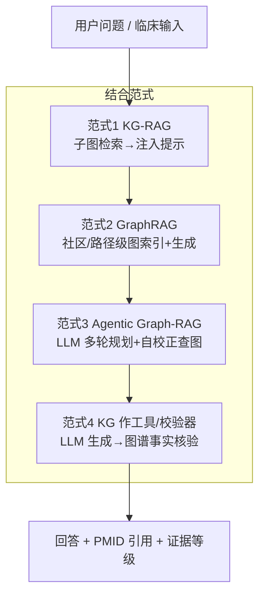

<!--
0.3 How ICKG combines with state-of-the-art LLMs (GPT / Claude / Gemini)
0.3 ICKG 如何与最先进大模型（GPT / Claude / Gemini）结合，优势与能解决的具体问题
-->

# 0.3 ICKG × 最先进大模型：如何结合、解决什么具体问题

> **要回答老师的问题**：大模型 + 知识图谱结合很流行，我的 ICKG 与 GPT/Claude/Gemini 这类最先进大模型怎么结合？有哪些优势？能具体解决什么问题？
>
> **一句话结论**：让**大模型负责"语言与推理"、ICKG 负责"事实与证据"**，二者按 KG-RAG → GraphRAG → Agentic Graph-RAG 三档由浅入深结合。结合后能落地一批"纯大模型做不可靠、纯图谱做不出人话"的具体应用：**防幻觉的免疫问答、可解释的临床决策支持、可追溯的报告解读、机制假设生成**。
>
> 与 [1.2 KG-RAG](../01_knowledge_applications/1.2_kg_rag.md) 的分工：本篇讲**战略层"为什么/有哪几种结合范式"**，1.2 讲**工程层最小实现**。

---

## 一、四种结合范式（由浅入深）

| 范式 | 大模型的角色 | ICKG 的角色 | 适用场景 |
|---|---|---|---|
| **1. KG-RAG** | 把子图改写成答案 | 提供 k-hop 证据子图 | 问答、报告解读（[1.2](../01_knowledge_applications/1.2_kg_rag.md)、[3.1](../03_other_applications/3.1_health_report_interpretation.md)） |
| **2. GraphRAG** | 在图索引/社区摘要上生成 | 提供图级索引与路径 | 全局性、综述性问题 |
| **3. Agentic Graph-RAG** | 多轮规划、自校正、决定查什么 | 被反复查询/验证的事实源 | 复杂多跳诊断、机制推理（参考 [Hu-2025](https://doi.org/10.3389/fmed.2025.1716327)、[Su-2024](https://arxiv.org/abs/2410.04660)） |
| **4. KG 作校验器** | 先生成，再被核验 | 对每条主张做"有无证据/是否矛盾"核验 | 高风险输出的事实门控 |

> 关键：GPT/Claude/Gemini 可以**即插即用地担任生成端**——ICKG 与具体模型解耦，今天接 Claude、明天接 Gemini 都不动底座；模型升级带来的语言能力提升会**直接放大**这套系统的体验，而事实可靠性始终由 ICKG 兜底。

---

## 二、结合后相对"纯大模型"的优势

1. **可溯源、防幻觉**：答案里每条结论挂着具体三元组与 PMID，可一键核验（治"听起来对其实错"）。
2. **多跳因果可控**：沿 ICKG 有向边推理，避免大模型"跳步脑补"。
3. **时效可控**：图谱增量更新即生效，无需重训模型。
4. **带证据分级**：可把 [3.1](../03_other_applications/3.1_health_report_interpretation.md) 的多维证据可靠性分级（频次/期刊/时效/临床吻合）一并喂给大模型，让它**按证据强弱措辞**（A 级可肯定、D 级仅作探索）。
5. **可审计、合规友好**：检索-生成两段式留痕，满足医疗场景的可解释与监管要求。
6. **模型无关**：底座一次建好，复用于任意先进大模型。

---

## 三、能具体解决什么问题（落地清单）

| 具体问题 | 结合方案 | 下游场景 |
|---|---|---|
| 免疫学问答总幻觉、没引用 | KG-RAG：子图注入 + 引用绑定 | [1.2](../01_knowledge_applications/1.2_kg_rag.md) |
| 体检/免疫报告看不懂、怕误读 | KG-RAG + 证据分级 + 强免责 | [3.1](../03_other_applications/3.1_health_report_interpretation.md) ⭐ |
| 想快速厘清某条免疫机制因果链 | 路径检索 + LLM 改写为叙事 | [1.3](../01_knowledge_applications/1.3_causal_discovery.md) |
| 鉴别诊断要可解释、可核查 | Agentic Graph-RAG + 反向 help_identify | [2.2](../02_clinical_applications/2.2_diagnosis.md) |
| ICI 响应预测要给"为什么" | GNN 预测 + 图路径解释 + LLM 叙述 | [2.3](../02_clinical_applications/2.3_treatment.md) |
| 想发现尚未报道的潜在关联 | KGE 链接预测 + LLM 合理性筛选 | [1.4](../01_knowledge_applications/1.4_new_knowledge_generation.md) |
| 高风险输出怕模型乱说 | KG 作事实校验器（范式4） | 贯穿 2.x / 3.x |

---

## 四、文献依据

- [Peng-2024] [**Graph Retrieval-Augmented Generation: A Survey**](https://doi.org/10.1145/3777378). *ACM TOIS*. GraphRAG 范式（图索引/图引导检索/图增强生成）的系统综述。
- [Soman-2024] [**Biomedical knowledge graph-optimized prompt generation for LLMs (KG-RAG / SPOKE)**](https://doi.org/10.1093/bioinformatics/btae560). *Bioinformatics*. KG-RAG 奠基工程。
- [Hu-2025] [**A self-correcting Agentic Graph RAG for clinical decision support in hepatology**](https://doi.org/10.3389/fmed.2025.1716327). *Front Med*. Agentic Graph-RAG 自校正样板。
- [Su-2024] [**KGARevion: Knowledge Graph Based Agent for Complex Knowledge-Intensive QA in Medicine**](https://arxiv.org/abs/2410.04660). *arXiv*. KG-Agent 处理复杂多跳医学问答。
- [Liu-2025-JAMIA] [**Detecting emergencies in patient portal messages using LLMs and KG-based RAG**](https://doi.org/10.1093/jamia/ocaf059). *JAMIA*. 真实部署的 KG-RAG 临床系统。

## 五、推荐深读

- ⭐⭐ [Peng-2024 GraphRAG Survey](https://doi.org/10.1145/3777378) — 必读：四种结合范式的全景。
- ⭐⭐ [Hu-2025 Agentic Graph-RAG](https://doi.org/10.3389/fmed.2025.1716327) — 必读：专科场景端到端结合。
- ⭐ [Soman-2024 SPOKE-KG-RAG](https://doi.org/10.1093/bioinformatics/btae560) — KG-RAG 起步范本。

miao!
