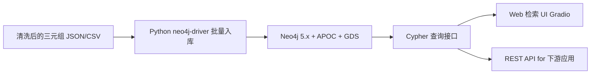

<!--
1.1 Knowledge Retrieval and Graph QA
1.1 知识检索与图谱问答
-->

# 1.1 免疫知识的精准检索与即时问答

> **使用场景 / 解决的问题**：科研与临床人员常需要按"实体-关系"在百万级免疫文献里**秒级取证**（如"PD-L1 在哪些免疫细胞上表达、又被哪些药物调控？"），而传统关键词/全文检索做不到这种结构化提问。ICKG 把 42 万条三元组变成可查询的结构化底座，**用一句 Cypher 即可拿到带 PMID 回链的精确答案**，把"大海捞针式翻文献"变成"按图索骥"。

## 一、应用价值

免疫学知识高度分散在百万级文献中，**临床医生与科研人员希望以"实体-关系"为单位进行精准检索**（而非传统的关键词/文本相似度检索），例如：
- "PD-L1 在哪些免疫细胞上表达，并被哪些药物调控？"
- "与 Treg 比例升高相关的所有自身免疫疾病有哪些？"
- "IL-6 → 哪些细胞 → 哪些疾病？"（2-hop 因果）

这类问题对**结构化检索**有天然需求，而 ICKG 的 423K 三元组恰好是答案的最佳基础设施。

## 二、ICKG 适配性

- **节点规模**：235K 实体 → 已覆盖 *cell_type / phenotype / protein / disease / intervention* 等绝大多数检索需求。
- **关系丰富**：89 类关系（含 `help_identify`、`treatment_for` 等临床直接可用语义）。
- **来源可追溯**：每条三元组在抽取时保留了 PMID，可作为引文回链。

## 三、技术路线



入库时建议的图模型：
- 节点 Label = 实体类型（`:Disease`, `:CellType`, `:Protein` …）
- 关系 Type = 关系名称大写（`:ASSOCIATED_WITH`, `:INCREASES`, …）
- 节点/关系属性：`name`, `pmids: [int]`, `source: 'ICKG-v1'`, `frequency: int`

## 四、最小可执行示例

### 4.1 入库脚本骨架（Python）

```python
# ickg_neo4j_import.py
# 假设三元组 CSV 列：head, head_type, relation, tail, tail_type, pmid
import csv, argparse
from neo4j import GraphDatabase

def parse_args():
    p = argparse.ArgumentParser(description="将 ICKG 三元组导入 Neo4j")
    p.add_argument("--triples", "-t", required=True, help="三元组 CSV 路径")
    p.add_argument("--uri", default="bolt://localhost:7687", help="Neo4j Bolt URI")
    p.add_argument("--user", default="neo4j", help="用户名")
    p.add_argument("--password", required=True, help="密码")
    return p.parse_args()

CYPHER = """
MERGE (h:Entity {name: $head}) SET h:%s
MERGE (t:Entity {name: $tail}) SET t:%s
MERGE (h)-[r:%s]->(t)
ON CREATE SET r.pmids = [$pmid], r.frequency = 1
ON MATCH  SET r.pmids = r.pmids + $pmid, r.frequency = r.frequency + 1
"""

def main():
    args = parse_args()
    drv = GraphDatabase.driver(args.uri, auth=(args.user, args.password))
    with drv.session() as s, open(args.triples, encoding="utf-8") as f:
        for row in csv.DictReader(f):
            q = CYPHER % (row["head_type"].title(), row["tail_type"].title(),
                          row["relation"].upper())
            s.run(q, head=row["head"], tail=row["tail"], pmid=int(row["pmid"]))
    drv.close()

if __name__ == "__main__":
    main()
```

### 4.2 临床检索 Cypher 示例

```cypher
// Q1: 与 CD8+ T cell 相关的所有疾病（按证据数排序）
MATCH (c:CellType {name: "CD8+ T cell"})-[r:ASSOCIATED_WITH]-(d:Disease)
RETURN d.name AS disease, r.frequency AS evidence_count, r.pmids[..5] AS sample_pmids
ORDER BY evidence_count DESC LIMIT 20;

// Q2: PD-L1 调控的 2-hop 路径（蛋白 → 细胞 → 疾病）
MATCH path = (p:Protein {name: "PD-L1"})-[*1..2]-(d:Disease)
WHERE ALL(r IN relationships(path) WHERE type(r) IN ['INCREASES','DECREASES','INHIBITS','PROMOTES'])
RETURN path LIMIT 50;

// Q3: 推荐针对 "rheumatoid arthritis" 的 intervention
MATCH (i:Intervention)-[:TREATMENT_FOR]->(d:Disease {name: "rheumatoid arthritis"})
RETURN i.name AS intervention, count(*) AS support
ORDER BY support DESC LIMIT 10;
```

### 4.3 示例输入输出

**输入（Cypher 查询，Q1）**：
```cypher
MATCH (c:CellType {name: "CD8+ T cell"})-[r:ASSOCIATED_WITH]-(d:Disease)
RETURN d.name, r.frequency, r.pmids[..3]
ORDER BY r.frequency DESC LIMIT 5;
```

**输出（节选）**：

| disease | evidence_count | sample_pmids |
|---|---|---|
| melanoma | 1247 | [32296182, 33024073, 33177712] |
| non-small cell lung carcinoma | 982 | [31178128, 32238966, 33503570] |
| chronic hepatitis B | 537 | [30396637, 30943176, 31345984] |
| HIV infection | 481 | [31041437, 31523213, 31988504] |
| rheumatoid arthritis | 412 | [30523218, 31239486, 32157003] |

> 每一行均可点击 PMID 跳转 PubMed 原文核验，构成可追溯的检索结果。

---

## 五、文献依据

- [Zhou-2026] [**Fine-tuned large language models with structured prompts enable efficient construction of lung cancer knowledge graphs**](https://doi.org/10.1038/s41746-025-02232-y). *npj Digit Med*. LCKG 论文，给出 Neo4j+Cypher 在临床知识图谱上的工程范例。
- [Atallah-2020] [**ImmunoGlobe: enabling systems immunology with a manually curated intercellular immune interaction network**](https://pubmed.ncbi.nlm.nih.gov/32778050/). *BMC Bioinformatics*. 首个手工策划的免疫细胞间相互作用图谱，可作 ICKG 检索结果的对照标准。
- [Shao-2021] [**CellTalkDB: a manually curated database of ligand-receptor interactions in humans and mice**](https://pubmed.ncbi.nlm.nih.gov/33147626/). *Brief Bioinform*. 配体-受体先验数据，可与 ICKG 在 `protein` 节点上互补。

## 六、可行性与挑战

| 维度 | 评估 | 说明 |
|---|---|---|
| 数据就绪度 | ★★★★★ | 三元组与 PMID 已具备 |
| 工程复杂度 | ★★ | Neo4j 部署 + 入库 + Cypher 即可 |
| 算力需求 | ★ | 单机即可（图规模约 25 万节点，Neo4j 轻松承载） |
| 主要挑战 | — | **实体规范化**：同义词合并（`CD8+ T cell` vs `CD8 T lymphocyte`）；建议用 [Cui-2024](https://doi.org/10.1038/s41586-023-06816-9) 的标准命名表对齐 |

## 七、推荐深读

- ⭐ [Zhou-2026 LCKG](https://doi.org/10.1038/s41746-025-02232-y) — 必读：直接照抄其 Cypher 用例与命名规范。
- [Atallah-2020 ImmunoGlobe](https://pubmed.ncbi.nlm.nih.gov/32778050/) — 看免疫学 KG 是怎么手工策划的，理解 ICKG 的提升空间。
- [Shao-2021 CellTalkDB](https://pubmed.ncbi.nlm.nih.gov/33147626/) — 与 ICKG 互补，做配体-受体对齐校验。

miao!
