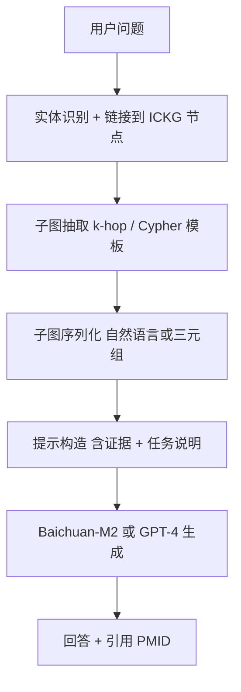

<!--
1.2 KG-RAG: LLM-Augmented QA with Knowledge Graph
1.2 KG-RAG: 知识图谱增强的 LLM 问答
-->

# 1.2 KG-RAG：知识图谱增强的 LLM 问答

## 一、应用价值

纯 LLM 在免疫学问答上常见三大问题：**幻觉（hallucination）、引用缺失、知识时效性不足**。传统向量 RAG 虽能引入文献片段，但**对多跳推理（"A 增加 B，B 抑制 C"）支持薄弱**。

**KG-RAG（Knowledge-Graph-augmented RAG）** 通过把 ICKG 子图直接注入 LLM 上下文，使回答具备：
1. 可解释（每个结论可追溯到三元组及 PMID）
2. 多跳推理能力（沿因果边遍历）
3. 时效可控（KG 增量更新即可）

## 二、ICKG 适配性

- ICKG 含 423K 三元组、含 PMID 来源，**天然适合作为可引用证据源**。
- 89 类关系语义清晰，便于序列化为自然语言三元组喂给 LLM。
- 项目已有 Baichuan-M2-32B 微调模型，可直接做 RAG 的生成端。

## 三、技术路线



两种主流模式：
- **Text-to-Cypher**：让 LLM 把自然语言问题翻译成 Cypher，查询 Neo4j 后把结果再喂回 LLM。
- **Subgraph-to-Text**：先用实体链接抓出 k-hop 子图，序列化为三元组列表注入提示。Soman 2024 与 MedSumGraph 走的就是这条路。

## 四、最小可执行示例

### LangChain Neo4j GraphCypherQAChain（Text-to-Cypher）

```python
# ickg_kg_rag.py
import argparse
from langchain_community.graphs import Neo4jGraph
from langchain_community.chains.graph_qa.cypher import GraphCypherQAChain
from langchain_openai import ChatOpenAI

def parse_args():
    p = argparse.ArgumentParser(description="基于 Neo4j 的 ICKG KG-RAG 问答")
    p.add_argument("--question", "-q", required=True, help="用户的免疫学问题")
    p.add_argument("--uri",   default="bolt://localhost:7687", help="Neo4j Bolt URI")
    p.add_argument("--user",  default="neo4j", help="Neo4j 用户名")
    p.add_argument("--password", required=True, help="Neo4j 密码")
    p.add_argument("--model", default="gpt-4o-mini", help="生成端 LLM")
    return p.parse_args()

def main():
    a = parse_args()
    graph = Neo4jGraph(url=a.uri, username=a.user, password=a.password)
    chain = GraphCypherQAChain.from_llm(
        cypher_llm=ChatOpenAI(model=a.model, temperature=0),
        qa_llm=ChatOpenAI(model=a.model, temperature=0),
        graph=graph, verbose=True, return_intermediate_steps=True)
    out = chain.invoke({"query": a.question})
    print("【回答】", out["result"])
    print("【生成的 Cypher】", out["intermediate_steps"][0]["query"])
    print("【证据子图】", out["intermediate_steps"][1]["context"])

if __name__ == "__main__":
    main()
```

### 示例输入输出

**输入（自然语言问题）**：
> "PD-L1 在肿瘤微环境中如何抑制 CD8+ T 细胞的功能？"

**中间产物（LLM 生成的 Cypher）**：
```cypher
MATCH (p:Protein {name: "PD-L1"})-[r1:INHIBITS|DECREASES]->(c:CellType {name: "CD8+ T cell"})
OPTIONAL MATCH (c)-[r2:RESULTS_IN]->(ph:Phenotype)
RETURN p, r1, c, r2, ph LIMIT 20;
```

**输出（KG-RAG 生成的回答，节选）**：
> PD-L1 通过与 CD8+ T cell 上的 PD-1 结合，抑制 T cell 受体（TCR）下游信号通路 [PMID: 18173375]，进而 **降低 T cell 增殖、IFN-γ 与 granzyme B 分泌**，导致细胞毒性功能受损 [PMID: 26193342]。在肿瘤微环境中，这一机制是免疫逃逸的核心，也是 anti-PD-(L)1 单抗（如 Pembrolizumab、Atezolizumab）的作用靶点 [PMID: 28525752]。
>
> **证据来源**：ICKG 子图 3 个三元组 + 3 篇 PubMed 文献。

---

### 与传统 RAG 的对比

| 维度 | 向量 RAG | **KG-RAG（ICKG）** |
|---|---|---|
| 检索粒度 | 段落 chunk | 实体 + 关系 + 子图 |
| 多跳推理 | 弱 | **强**（沿 KG 有向边） |
| 引用粒度 | 文献级 | **三元组级 + PMID** |
| 幻觉风险 | 中 | 低（生成被结构约束） |
| 知识更新 | 重新索引 | KG 增量更新 |
| 数学/数值题 | 弱 | 中（KG 不存数值） |

## 五、文献依据

- [Soman-2024] [**Biomedical knowledge graph-optimized prompt generation for large language models**](https://doi.org/10.1093/bioinformatics/btae560). *Bioinformatics*. SPOKE-KG-RAG 框架，KG-RAG 范式的奠基性工程。
- [Su-2024] [**Knowledge Graph Based Agent for Complex, Knowledge-Intensive QA in Medicine (KGARevion)**](https://arxiv.org/abs/2410.04660). *arXiv*. Zitnik 团队的 KG-Agent，把多跳问答转化为 Agent + KG 验证流程。
- [Kim-2026] [**MedSumGraph: enhancing GraphRAG for medical QA with summarization and optimized prompts**](https://doi.org/10.1016/j.artmed.2025.103311). *Artif Intell Med*. 针对医学问答优化的 GraphRAG 子图摘要 + 提示构造，可直接借鉴。
- [Gao-2025-Dx] [**Leveraging Medical Knowledge Graphs Into Large Language Models for Diagnosis Prediction**](https://doi.org/10.2196/58670). *JMIR AI*. 系统比较 KG-augmented LLM 在诊断预测上的设计选择。

## 六、可行性与挑战

| 维度 | 评估 | 说明 |
|---|---|---|
| 数据就绪度 | ★★★★ | 三元组就绪，需先入 Neo4j（见 1.1） |
| 工程复杂度 | ★★★ | LangChain/LlamaIndex 模板即可起步 |
| 算力需求 | ★★ | LLM 调用成本主导 |
| 主要挑战 | — | **实体链接质量**（同义词消歧）；**子图大小控制**（>2-hop 易爆炸，建议限制 token 预算） |

## 七、推荐深读

- ⭐ [Soman-2024 SPOKE-KG-RAG](https://doi.org/10.1093/bioinformatics/btae560)
- ⭐ [Kim-2026 MedSumGraph](https://doi.org/10.1016/j.artmed.2025.103311) — 提示构造与摘要策略对工程化最有指导意义
- [Su-2024 KGARevion](https://arxiv.org/abs/2410.04660) — 看 Agent 模式如何处理复杂多跳问题

miao!
