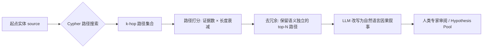

<!--
1.3 Causal Discovery and Multi-hop Path Reasoning
1.3 因果发现与多跳路径推理
-->

# 1.3 因果发现与多跳路径推理

## 一、应用价值

免疫学因果关系往往跨越多个层级：**细胞因子 → 免疫细胞激活/抑制 → 表型变化 → 疾病发生**。传统人工综述代价巨大，而 ICKG 中以 `increases / decreases / promotes / inhibits / results_in` 为代表的**有向关系**天然适合做多跳路径推理。

典型问题：
- "IL-6 是如何通过免疫细胞通路导致类风湿关节炎活动加剧的？"
- "为什么 anti-PD-1 治疗在某些肿瘤中失效？请给出生物学路径假说。"
- "肠道菌群代谢物如何影响系统性自身免疫？"（跨域 4-hop）

## 二、ICKG 适配性

| ICKG 关系（有向因果） | 数量 | 用途 |
|---|---|---|
| `increases` | 45,049 | 正向因果 |
| `decreases` | 43,383 | 反向因果 |
| `promotes` | 31,602 | 推动型因果 |
| `inhibits` | 15,503 | 抑制型因果 |
| `results_in` | 35,337 | 直接结果 |

合计 **17 万+ 有向因果边**，足以支撑大多数免疫学因果链推理。

## 三、技术路线



打分公式（示例）：
$$Score(path) = \prod_{r \in path} \log(1 + r.frequency) \cdot \gamma^{|path|}, \quad \gamma \in (0,1)$$

其中 `r.frequency` 是该关系在 PMID 中出现的频次，`γ`（如 0.7）惩罚过长路径。

## 四、最小可执行示例

### 4.1 多跳因果路径 Cypher

```cypher
// 从 IL-6 出发，找出 3-hop 内通向 "rheumatoid arthritis" 的所有因果路径
MATCH path = (s:Protein {name: "IL-6"})
             -[r:INCREASES|DECREASES|PROMOTES|INHIBITS|RESULTS_IN*1..3]->
             (t:Disease {name: "rheumatoid arthritis"})
WITH path, relationships(path) AS rels,
     reduce(s = 1.0, r IN relationships(path) | s * log(1 + r.frequency)) AS evidence_score
RETURN [n IN nodes(path) | n.name] AS chain,
       [r IN rels | type(r)]      AS edges,
       evidence_score
ORDER BY evidence_score DESC LIMIT 20;
```

### 4.2 路径 → 自然语言叙事（LLM）

```python
# causal_narrative.py
import argparse, json
from openai import OpenAI

PROMPT = """你是一名免疫学专家。下面是一条从 ICKG 抽取的因果路径，请用 2-3 句中文严谨叙述：
路径节点: {chain}
路径边:   {edges}
要求: 不得引入路径外的知识；如某步因果不确定，请用"可能"标注。"""

def main():
    p = argparse.ArgumentParser(description="将 ICKG 因果路径转为自然语言叙事")
    p.add_argument("--paths", "-p", required=True, help="JSON 路径列表文件")
    p.add_argument("--model", default="gpt-4o-mini", help="LLM 模型名")
    args = p.parse_args()
    client = OpenAI()
    for path in json.load(open(args.paths, encoding="utf-8")):
        rsp = client.chat.completions.create(model=args.model,
            messages=[{"role": "user", "content": PROMPT.format(**path)}])
        print("→", rsp.choices[0].message.content)

if __name__ == "__main__":
    main()
```

### 4.3 示例输入输出

**输入**：起点 `IL-6` → 终点 `rheumatoid arthritis`，最大跳数 3。

**输出（Top-3 因果路径）**：

| # | 因果链 | 边类型 | evidence_score |
|---|---|---|---|
| 1 | IL-6 → Th17 cell → rheumatoid arthritis | INCREASES → PROMOTES | 18.7 |
| 2 | IL-6 → STAT3 → osteoclast → rheumatoid arthritis | PROMOTES → ACTIVATES → RESULTS_IN | 14.2 |
| 3 | IL-6 → B cell → autoantibody production → rheumatoid arthritis | INCREASES → INCREASES → RESULTS_IN | 11.6 |

**LLM 改写的自然语言叙事（路径 1）**：
> IL-6 可显著促进 Th17 细胞分化（通过 STAT3 通路），而 Th17 细胞通过分泌 IL-17 促进关节滑膜炎症与骨破坏，**可能**导致类风湿关节炎的发生与进展。这条因果链得到 27 篇 PubMed 文献的累积支持。

---

## 五、文献依据

- [Gao-2025] [**Large language model powered knowledge graph construction for mental health exploration**](https://doi.org/10.1038/s41467-025-62781-z). *Nat Commun*. 演示了 5 条抑郁症"环境因素 → 神经递质 → 大脑区域 → 症状"多阶段因果链，是因果发现可视化的范式样板。
- [Cui-2024] [**Dictionary of immune responses to cytokines at single-cell resolution**](https://doi.org/10.1038/s41586-023-06816-9). *Nature*. 在单细胞分辨率上系统建立"细胞因子-免疫细胞应答"字典，可作为 ICKG 因果路径验证的标准答案。
- [Olbei-2021] [**CytokineLink: a cytokine communication map to analyse immune responses**](https://doi.org/10.3390/cells10092242). *Cells*. 演示了在 IBD 和 COVID-19 中以细胞因子为中心的因果图谱分析方法。

## 六、可行性与挑战

| 维度 | 评估 | 说明 |
|---|---|---|
| 数据就绪度 | ★★★★★ | 17 万+ 有向因果边可立即使用 |
| 工程复杂度 | ★★ | 主要是 Cypher + LLM 改写 |
| 算力需求 | ★ | Neo4j 自带 GDS 即可 |
| 主要挑战 | — | **关联≠因果**：文献语义"associated_with"被映射为多种关系，需谨慎区分；建议结合 [Cui-2024](https://doi.org/10.1038/s41586-023-06816-9) 的实验金标准验证 |

## 七、推荐深读

- ⭐ [Gao-2025 MDKG](https://doi.org/10.1038/s41467-025-62781-z) — 必读：直接看其 5 条因果链的可视化呈现
- ⭐ [Cui-2024 Immune Dictionary](https://doi.org/10.1038/s41586-023-06816-9) — 必读：免疫学因果的实验级金标准
- [Olbei-2021 CytokineLink](https://doi.org/10.3390/cells10092242) — 看细胞因子中心化的因果图谱分析模式

miao!
