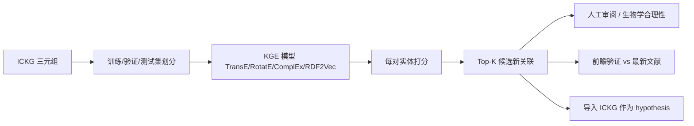

<!--
1.4 New Knowledge Generation via KG Link Prediction
1.4 链接预测与新知识生成
-->

# 1.4 链接预测与新知识生成

## 一、应用价值

ICKG 由 LLM 从历史文献抽取得到，**其本身是"已知知识"的快照**。但 KG embedding 可以做一件传统检索做不到的事：**预测尚未被显式报道的关系**（link prediction），形成"机器生成的科学假设"。这是 KG 服务于科研的核心增量价值。

典型场景：
- 预测"某细胞类型 ↔ 某疾病"的潜在关联（用于罕见病机制研究）
- 预测"某细胞因子 → 某表型"的潜在影响（用于新干预设计）
- 预测"某干预 ↔ 某疾病"的潜在适应症（→ 进入 [3.1 药物重定位](../03_other_applications/3.1_drug_repurposing.md)）

## 二、ICKG 适配性

- **235K 实体 + 89 类关系**：规模与异构性足以训练有竞争力的 KGE 模型。
- 关系语义清晰（`treatment_for`, `help_identify`, `inhibits` 等），可分关系训练或多任务训练。
- 与 PubMed 时间戳结合，可做**前瞻性验证**：训练截至 2024，预测 2025-2026 的新关联是否被文献证实。

## 三、技术路线



**模型对比建议**：

| 模型 | 优势 | 适用关系 |
|---|---|---|
| **TransE** | 简单、速度快 | 1-N 关系少时 |
| **RotatE** | 处理对称/反对称/合成关系 | 因果链推理 |
| **ComplEx** | 处理 1-N、N-1、N-N | ICKG 这种多对多语义 |
| **RDF2Vec** | 与 Gao 2025 范式一致，便于下游临床预测 | 与 [2.1 预防](../02_clinical_applications/2.1_prevention.md) 复用 |

## 四、最小可执行示例

### PyKEEN 链接预测

```python
# ickg_link_prediction.py
import argparse
from pykeen.pipeline import pipeline
from pykeen.triples import TriplesFactory

def parse_args():
    p = argparse.ArgumentParser(description="在 ICKG 上训练 KGE 模型并预测新关联")
    p.add_argument("--triples", "-t", required=True, help="三元组 TSV 文件：head\\trelation\\ttail")
    p.add_argument("--model",   "-m", default="ComplEx", help="KGE 模型 (TransE/RotatE/ComplEx)")
    p.add_argument("--dim",     "-d", type=int, default=200, help="embedding 维度")
    p.add_argument("--epochs",  "-e", type=int, default=100, help="训练轮数")
    p.add_argument("--out",     "-o", required=True, help="模型与日志输出目录")
    return p.parse_args()

def main():
    a = parse_args()
    tf = TriplesFactory.from_path(a.triples, create_inverse_triples=True)
    train, val, test = tf.split([0.8, 0.1, 0.1])
    result = pipeline(
        training=train, validation=val, testing=test,
        model=a.model,
        model_kwargs={"embedding_dim": a.dim},
        training_kwargs={"num_epochs": a.epochs},
        evaluation_kwargs={"batch_size": 256},
        random_seed=42,
    )
    result.save_to_directory(a.out)
    print(f"训练完成: MRR={result.metric_results.get_metric('mean_reciprocal_rank'):.4f}")

if __name__ == "__main__":
    main()
```

### 推断"新疾病-细胞关联"

```python
# 训练完成后，预测 PD-1+ TIM-3+ CD8 T cell 可能关联但尚未报道的疾病
from pykeen.predict import predict_target
top = predict_target(
    model=result.model, head="PD-1+ TIM-3+ CD8 T cell",
    relation="ASSOCIATED_WITH", triples_factory=train)
print(top.df.head(20))
```

### 示例输入输出

**输入**：`(head="PD-1+ TIM-3+ CD8 T cell", relation="ASSOCIATED_WITH", tail=?)`，要求返回 ICKG 中尚未直接连接但模型预测概率最高的 Top-5 疾病。

**输出（KGE 链接预测结果）**：

| rank | tail (predicted disease) | score | 是否已在训练集中存在直接边 |
|---|---|---|---|
| 1 | hepatocellular carcinoma         | 0.842 | 否（新候选） |
| 2 | chronic lymphocytic leukemia     | 0.811 | 否（新候选） |
| 3 | tuberculosis                     | 0.793 | 是（已知） |
| 4 | chronic hepatitis C              | 0.778 | 是（已知） |
| 5 | esophageal squamous carcinoma    | 0.762 | 否（**值得人工审阅的新假设**） |

> 解读：模型在已知关联上有较高得分（rank 3/4），同时给出 3 个 ICKG 中暂无直接边的新候选，可送给免疫学家做生物学合理性判断或作为下游 wet-lab 验证的优先池。

---

## 五、文献依据

- [Liu-2024] [**A probabilistic knowledge graph for target identification**](https://doi.org/10.1371/journal.pcbi.1011945). *PLOS Comput Biol*. 在 KG 上用概率推理识别免疫与肿瘤新靶点的范式。
- [Chandak-2023] [**Building a knowledge graph to enable precision medicine (PrimeKG)**](https://doi.org/10.1038/s41597-023-01960-3). *Sci Data*. 用 PrimeKG 做精准医学链接预测的工业级数据底座。
- [Caufield-2023] [**KG-Hub: building and exchanging biological knowledge graphs**](https://doi.org/10.1093/bioinformatics/btad418). *Bioinformatics*. KG 构建+预测工具链与共享方案。
- [Cui-2024] [**Dictionary of immune responses to cytokines at single-cell resolution**](https://doi.org/10.1038/s41586-023-06816-9). *Nature*. 可作为"细胞-细胞因子"链接预测的金标准评估集。

## 六、可行性与挑战

| 维度 | 评估 | 说明 |
|---|---|---|
| 数据就绪度 | ★★★★ | 三元组就绪，需做 train/val/test 切分 |
| 工程复杂度 | ★★★ | PyKEEN 一键起步，调参与评估较细 |
| 算力需求 | ★★★ | ComplEx 在 25 万节点上需 1×A100/V100，~数小时 |
| 主要挑战 | — | **冷启动实体**（频次=1）效果差；**评估金标准**少（建议用 [Cui-2024](https://doi.org/10.1038/s41586-023-06816-9) 与时间外推验证） |

## 七、推荐深读

- ⭐ [Liu-2024 Probabilistic KG](https://doi.org/10.1371/journal.pcbi.1011945) — 必读：免疫/肿瘤靶点发现的可迁移方法
- ⭐ [Chandak-2023 PrimeKG](https://doi.org/10.1038/s41597-023-01960-3) — 必读：看精准医学 KG 的数据底座如何组织
- [Caufield-2023 KG-Hub](https://doi.org/10.1093/bioinformatics/btad418) — 看 KG 构建-训练-发布的全链路工具

miao!
