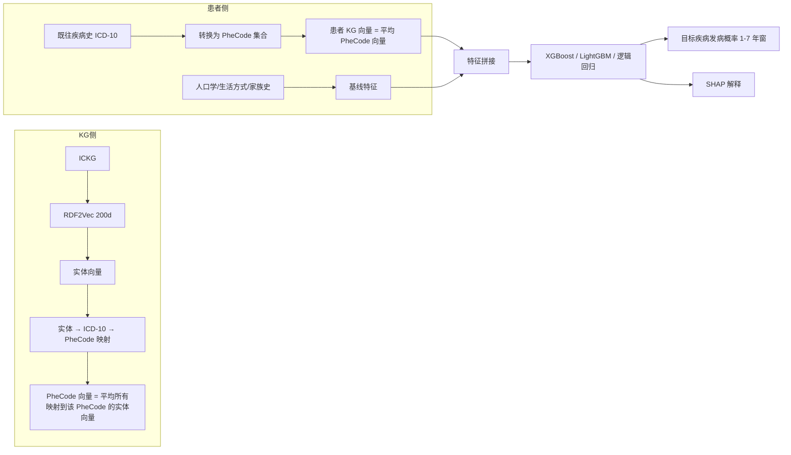

<!--
2.1 Prevention: KG-Embedding-Powered Risk Prediction
2.1 预防：基于知识图谱嵌入的免疫相关疾病风险预测
-->

# 2.1 预防：免疫相关疾病的早期风险预测

## 一、应用价值

自身免疫疾病（SLE、RA、IBD、T1D 等）、过敏性疾病、免疫缺陷综合征普遍**起病隐匿、确诊滞后 5–10 年**。如果能基于个体的早期临床/生活方式特征 **提前 1–7 年识别高风险人群**，将显著改变这一类疾病的预后。

[Gao-2025] 的 MDKG 论文已经证明：将 KG embedding 与 EHR 特征拼接送入分类器，在抑郁症/焦虑/双相预测上 AUC 提升 0.03–0.12，**在特征稀缺场景（仅环境因素）提升尤为显著（0.63 → 0.75）**。ICKG 完全可以复刻这一范式，把疾病焦点从精神疾病换成免疫相关疾病。

## 二、ICKG 适配性

| 资源 | ICKG 提供 | 用途 |
|---|---|---|
| 疾病实体 | 118,719 个 | 覆盖几乎所有免疫相关疾病 |
| 表型节点 | 166,366 个 | 与临床特征（实验室指标、症状）对齐 |
| 细胞类型 | 55,301 个 | 作为机制层中介，构建可解释路径 |
| `help_identify` 关系 | 38,337 条 | 直接抓出生物标志物，可作为特征筛选先验 |

## 三、技术路线（完全照搬 Gao-2025 范式）



## 四、最小可执行示例

```python
# autoimmune_risk_predict.py
import argparse, pandas as pd, numpy as np
from sklearn.model_selection import train_test_split
from sklearn.metrics import roc_auc_score, average_precision_score
import xgboost as xgb
import shap

def parse_args():
    p = argparse.ArgumentParser(description="基于 ICKG embedding + EHR 的自身免疫疾病风险预测")
    p.add_argument("--ehr",       "-e", required=True, help="患者 EHR CSV (含 phecodes 列与基线特征)")
    p.add_argument("--kg_vec",    "-k", required=True, help="ICKG PheCode 向量 NPZ (phecode -> 200d)")
    p.add_argument("--label_col", "-l", required=True, help="目标疾病标签列名 (0/1)")
    p.add_argument("--out",       "-o", required=True, help="模型与评估结果输出目录")
    return p.parse_args()

def patient_kg_vec(phecodes, kg_vec_dict, dim=200):
    """对患者拥有的 phecodes 取平均向量"""
    vecs = [kg_vec_dict[c] for c in phecodes if c in kg_vec_dict]
    return np.mean(vecs, axis=0) if vecs else np.zeros(dim)

def main():
    a = parse_args()
    ehr = pd.read_csv(a.ehr)
    kg  = dict(np.load(a.kg_vec, allow_pickle=True).items())
    # 1. 构造 KG 向量特征
    kg_feat = np.stack([patient_kg_vec(eval(row), kg) for row in ehr["phecodes"]])
    # 2. 与基线特征拼接
    base = ehr.drop(columns=["phecodes", a.label_col]).values
    X = np.hstack([base, kg_feat])
    y = ehr[a.label_col].values
    # 3. 训练
    Xtr, Xte, ytr, yte = train_test_split(X, y, test_size=0.2, stratify=y, random_state=42)
    clf = xgb.XGBClassifier(n_estimators=500, max_depth=6, learning_rate=0.05,
                            eval_metric="auc")
    clf.fit(Xtr, ytr, eval_set=[(Xte, yte)], verbose=False)
    proba = clf.predict_proba(Xte)[:, 1]
    print(f"AUC={roc_auc_score(yte, proba):.4f}  PR-AUC={average_precision_score(yte, proba):.4f}")
    # 4. SHAP 可解释
    shap.summary_plot(shap.TreeExplainer(clf).shap_values(Xte), Xte, show=False)

if __name__ == "__main__":
    main()
```

### 示例输入输出

**输入（一行患者数据，节选）**：
```json
{
  "patient_id":  "UKB-1024",
  "age":         42,
  "sex":         "F",
  "bmi":         24.1,
  "smoking":     0,
  "family_hx_autoimmune": 1,
  "phecodes":    "['250.1', '244.4', '714.0']",   // T1D, 甲减, RA 史
  "target_5yr_IBD": 0                              // 标签
}
```

**输出（预测 + SHAP 解释）**：

| patient_id | risk_prob_5yr_IBD | rank_in_cohort | top SHAP 特征 |
|---|---|---|---|
| UKB-1024 | 0.187 | top 4.3% | `kg_vec[37]`(↑Treg-related), 家族史(+), 244.4 甲减(+) |
| UKB-2087 | 0.024 | bottom 38% | `kg_vec[12]`(↓IL-23 通路), 无家族史(-) |

**评估指标（验证集，假设值）**：

| 模型 | AUC | PR-AUC | 提前年数 |
|---|---|---|---|
| 仅基线特征 | 0.71 | 0.18 | 5 年 |
| 仅 KG 向量 | 0.74 | 0.21 | 5 年 |
| **KG + 基线** | **0.82** | **0.31** | **5 年** |

> 与 [Gao-2025 MDKG](https://doi.org/10.1038/s41467-025-62781-z) 在 MDD 上观察到的提升趋势一致（环境因素 only：0.63 → 0.75）。

---

## 五、文献依据

- ⭐ [Gao-2025] [**Large language model powered knowledge graph construction for mental health exploration**](https://doi.org/10.1038/s41467-025-62781-z). *Nat Commun*. **方法学范式直接照搬**：RDF2Vec 200d → PheCode 映射 → 特征拼接 → AUC 0.82-0.89。
- [Wang-2026] [**Knowledge-graph embeddings for osteoarthritis candidate prediction**](https://doi.org/10.1038/s41746-025-02290-x). *npj Digit Med*. 最新 KGE+EHR 风险预测真实队列研究。
- [Yang-2025] [**Alzheimer's disease knowledge graph enhances knowledge discovery and disease prediction**](https://doi.org/10.1016/j.compbiomed.2025.110285). *Comput Biol Med*. 专病 KG + 嵌入 → 风险预测路径。
- [Carvalho-2023] [**Knowledge Graph Embeddings for ICU readmission prediction**](https://doi.org/10.1186/s12911-022-02070-7). *BMC Med Inform Decis Mak*. 验证本体/KG 嵌入与临床表型联合的有效性。

## 六、可行性与挑战

| 维度 | 评估 | 说明 |
|---|---|---|
| 数据就绪度 | ★★ | **关键卡点**：需要可用的免疫相关疾病 EHR 队列（UKB、All of Us、中国 ChinaMAP 等） |
| 工程复杂度 | ★★★ | KG embedding 训练 + Phecode 映射 + 分类器训练 |
| 算力需求 | ★★ | 单机即可，RDF2Vec 训练数小时 |
| 主要挑战 | — | **实体到 PheCode 的映射**：ICKG 实体名是英文文献术语，需用 UMLS / ICD-10 / SNOMED-CT 做规范化；**队列伦理审批** |

**推荐的目标疾病优先级**：
1. **IBD（克罗恩 vs 溃疡性结肠炎）**——文献量大、ICKG 覆盖好、UKB 有充分病例
2. **类风湿关节炎（RA）**——免疫机制清晰
3. **1 型糖尿病（T1D）**——早期识别价值最高
4. **系统性红斑狼疮（SLE）**——异质性大，可考虑亚型预测

## 七、推荐深读

- ⭐⭐ [Gao-2025 MDKG](https://doi.org/10.1038/s41467-025-62781-z) — 必读：本场景的方法论母本
- ⭐ [Wang-2026 OA KGE](https://doi.org/10.1038/s41746-025-02290-x) — 真实临床队列上的最新落地参考
- [Yang-2025 AD KG](https://doi.org/10.1016/j.compbiomed.2025.110285) — 专病 KG 的端到端验证
- [Carvalho-2023 ICU KGE](https://doi.org/10.1186/s12911-022-02070-7) — KG embedding 在临床预测的早期范式

miao!
