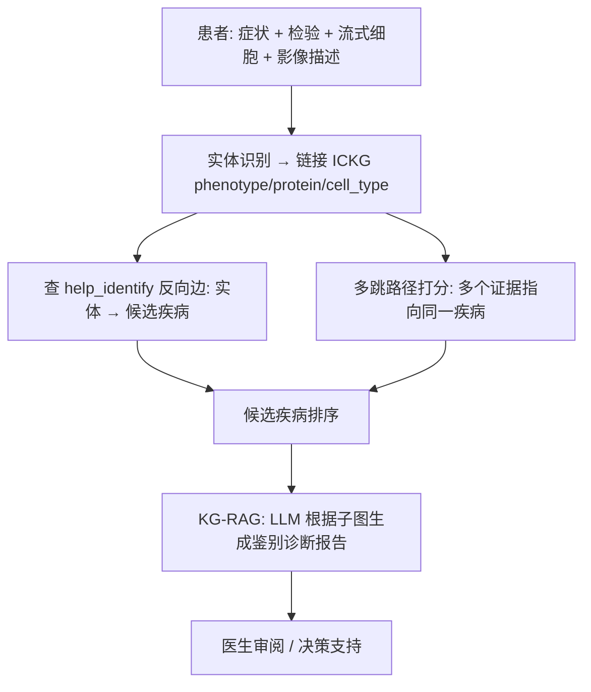

<!--
2.2 Diagnosis: Differential Diagnosis and Subtyping
2.2 诊断：免疫相关疾病的辅助诊断与亚型分型
-->

# 2.2 诊断：免疫相关疾病的辅助诊断与亚型分型

> **精准医疗定位**：本场景对应精准医疗全周期的**第二阶段「诊断」**——把患者的症状/检验/影像证据链到 ICKG，做可解释、可追溯的鉴别诊断与亚型分型，缩短确诊路径。

## 一、应用价值

免疫相关疾病的诊断面临三大挑战：
1. **症状重叠**：SLE、Sjögren、MCTD 等结缔组织病早期表现相似
2. **罕见免疫缺陷漏诊**：原发性免疫缺陷病平均诊断延迟 9–15 年
3. **亚型异质**：IBD（CD vs UC）、ALL（B-cell vs T-cell）、CAR-T 适应症选择

ICKG 可作为**辅助诊断的知识中介**：
- 把患者的症状+检验+影像特征链到 ICKG 节点
- 用 `help_identify` 关系反推可能的疾病/亚型
- 用 KG-augmented LLM 生成可解释的鉴别诊断建议

## 二、ICKG 适配性

- `help_identify` 关系 **38,337 条**——天然就是"标志物 → 疾病"映射
- `phenotype`（166K）+ `disease`（119K）+ `cell_type`（55K）三类节点足以表达大多数诊断证据
- `associated_with` 关系（66K）补充弱关联以提高召回

## 三、技术路线



## 四、最小可执行示例

### 候选疾病排序 Cypher

```cypher
// 输入：患者表型集合 (e.g., 关节痛、抗 dsDNA 阳性、补体 C3 降低)
// 输出：按支持度排序的候选疾病
WITH ["arthritis", "anti-dsDNA antibody", "low complement C3"] AS findings
UNWIND findings AS f
MATCH (p {name: f})-[r:HELP_IDENTIFY|ASSOCIATED_WITH]-(d:Disease)
WITH d, count(DISTINCT f) AS evidence_count,
     sum(r.frequency)    AS total_evidence
RETURN d.name AS disease, evidence_count, total_evidence
ORDER BY evidence_count DESC, total_evidence DESC LIMIT 10;
```

### KG-RAG 生成鉴别诊断（伪代码）

```python
# differential_diagnosis_kg_rag.py
import argparse, json
from kg_rag_utils import extract_subgraph, build_prompt, llm_generate

def parse_args():
    p = argparse.ArgumentParser(description="基于 ICKG 的鉴别诊断生成")
    p.add_argument("--findings", "-f", required=True, help="患者发现 JSON list")
    p.add_argument("--top_k",    "-k", type=int, default=5, help="候选疾病数")
    p.add_argument("--model",    "-m", default="gpt-4o-mini", help="生成模型")
    return p.parse_args()

PROMPT_TPL = """你是一名免疫学专科医生。基于以下从 ICKG 抽取的证据子图，给出按可能性排序的前 {k} 个候选诊断，并标注:
- 关键支持证据 (具体三元组)
- 仍需获取的检验/检查
- 不支持的反向证据 (如有)

患者发现: {findings}
ICKG 子图: {subgraph}
"""

def main():
    a = parse_args()
    findings = json.load(open(a.findings, encoding="utf-8"))
    subg = extract_subgraph(findings, k_hop=2)
    out  = llm_generate(a.model, PROMPT_TPL.format(k=a.top_k,
                        findings=findings, subgraph=subg))
    print(out)

if __name__ == "__main__":
    main()
```

### 示例输入输出

**输入（患者结构化发现）**：
```json
{
  "patient_id": "Case-018",
  "findings": [
    "polyarthritis of small joints",
    "anti-CCP antibody positive (185 U/mL)",
    "rheumatoid factor positive",
    "elevated CRP (38 mg/L)",
    "morning stiffness > 1 hour"
  ]
}
```

**输出（候选诊断 + 鉴别）**：

| rank | 候选诊断 | 支持证据 | 仍需检查 | 反向证据 |
|---|---|---|---|---|
| 1 | 类风湿关节炎（RA） | 抗 CCP + RF + 对称性小关节炎 + 晨僵 | X-ray 关节侵蚀 / DAS28 评分 | 无 |
| 2 | 银屑病关节炎 | 多关节炎 + CRP 升高 | 皮肤银屑病史 / HLA-B27 | 抗 CCP 阳性更倾向 RA |
| 3 | SLE 合并关节炎 | 多关节炎 | ANA / dsDNA / 补体 | 无典型皮肤/肾脏表现 |

**LLM 受控生成（节选）**：
> 患者最可能的诊断为 **类风湿关节炎（RA）**。理由：抗 CCP 阳性（PPV ~95%）+ RF 阳性 + 对称性小关节炎 + 晨僵 >1h 同时满足 2010 ACR/EULAR 分类标准 ≥6 分 [PMID: 20699241]。建议补充 X-ray、超声评估滑膜炎与关节侵蚀，启动 DAS28 评分以指导用药。
>
> 【免责声明】本回答仅为辅助决策，最终诊断须由具备资质的临床医生作出。

---

## 五、文献依据

- ⭐ [Gao-2025-Dx] [**Leveraging Medical Knowledge Graphs Into Large Language Models for Diagnosis Prediction**](https://doi.org/10.2196/58670). *JMIR AI*. 系统比较 KG-augmented LLM 在诊断预测上的设计选择。
- [Hu-2025] [**A self-correcting Agentic Graph RAG for clinical decision support in hepatology**](https://doi.org/10.3389/fmed.2025.1716327). *Front Med*. 专科 KG-RAG + Agent 自校正的最新样板，可迁移到免疫科。
- [Su-2024] [**KGARevion: Knowledge Graph Based Agent for Complex Knowledge-Intensive QA in Medicine**](https://arxiv.org/abs/2410.04660). *arXiv*. Zitnik 团队的医学 KG-Agent，复杂多跳问答优于普通 RAG。
- [Cui-2024] [**Dictionary of immune responses to cytokines at single-cell resolution**](https://doi.org/10.1038/s41586-023-06816-9). *Nature*. 可作为细胞-细胞因子层面的诊断金标准。

## 六、可行性与挑战

| 维度 | 评估 | 说明 |
|---|---|---|
| 数据就绪度 | ★★★ | KG 侧足够；患者侧需要结构化输入 |
| 工程复杂度 | ★★★ | 实体链接 + 子图抽取 + LLM 集成 |
| 算力需求 | ★★ | 主要是 LLM 调用 |
| 主要挑战 | — | **法律责任**：诊断辅助必须明确"非诊断"定位；**实体链接错误**会传导为诊断错误，需置信度阈值 |

## 七、推荐深读

- ⭐⭐ [Gao-2025-Dx](https://doi.org/10.2196/58670) — 必读：直接对标本场景的最新方法学比较
- ⭐ [Hu-2025 Hepatology Agent](https://doi.org/10.3389/fmed.2025.1716327) — 看专科场景的端到端设计
- [Su-2024 KGARevion](https://arxiv.org/abs/2410.04660) — 看复杂诊断推理的 Agent 实现

miao!
