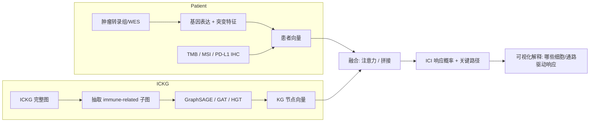

<!--
2.3 Treatment: Immune Checkpoint Inhibitor Response Prediction (Flagship Scenario)
2.3 治疗：免疫检查点抑制剂响应预测（旗舰场景）
-->

# 2.3 治疗：免疫检查点抑制剂（ICI）响应预测 ⭐ 旗舰场景

## 一、应用价值

肿瘤免疫治疗（特别是 PD-1/PD-L1、CTLA-4 检查点抑制剂）已改变多种癌症的治疗格局，但**仅 20–40% 患者真正获益**。可靠的响应预测器具有三方面价值：

1. **临床决策**：避免无效治疗、降低 irAE 风险、节约 ¥10 万+ /疗程的费用
2. **联合方案设计**：识别非响应者的耐药机制，推荐联合靶向/化疗
3. **新辅助试验入组**：富集可能响应者，提升 III 期试验效率

这是 ICKG 最具临床价值、且**有完整方法学先例可遵循**的旗舰场景。

## 二、ICKG 适配性

ICKG 是 ICI 响应预测的**理想知识中介**：

| ICKG 资产 | ICI 预测应用 |
|---|---|
| `cell_type` (CD8+ T、Treg、TAM、MDSC 等) | TME 细胞组分先验 |
| `protein` (PD-L1, CTLA-4, IFN-γ, TGF-β …) | 免疫调控分子先验 |
| `intervention` (Pembrolizumab, Nivolumab, Ipilimumab …) | 药物节点 |
| `inhibits / promotes` 关系 | 免疫激活/抑制路径 |
| `help_identify` 关系 | TMB、MSI-H、PD-L1 IHC 等已知生物标志物 |

## 三、技术路线（参照 Zhao-2023 / IRnet 范式）



**两种实现路径**：
- **A. KG-guided GNN**（[Zhao-2023] 范式）：把基因表达作为节点特征，沿 ICKG 边消息传递
- **B. KGE + 临床特征**（Gao-2025 范式）：把患者 ICD-10 / 用药史 → ICKG → 向量 → XGBoost

推荐**先做 B 跑通基线**，再做 A 追求 SOTA。

## 四、最小可执行示例

### KG-guided GNN（PyTorch Geometric 骨架）

```python
# ici_response_gnn.py
import argparse, torch
from torch_geometric.nn import HeteroConv, SAGEConv, Linear
from torch_geometric.loader import DataLoader

def parse_args():
    p = argparse.ArgumentParser(description="ICKG 引导的 GNN 预测 ICI 响应")
    p.add_argument("--patient_graphs", "-p", required=True, help="患者图 PyG Data 列表 .pt")
    p.add_argument("--labels",         "-l", required=True, help="响应标签 CSV (patient_id,label)")
    p.add_argument("--hidden",         "-d", type=int, default=128, help="隐藏维度")
    p.add_argument("--epochs",         "-e", type=int, default=80, help="训练轮数")
    p.add_argument("--out",            "-o", required=True, help="输出目录")
    return p.parse_args()

class ICKG_GNN(torch.nn.Module):
    def __init__(self, in_dim, hidden, num_classes=2):
        super().__init__()
        self.conv1 = HeteroConv({
            ("gene", "expressed_in", "cell"): SAGEConv((-1, -1), hidden),
            ("cell", "inhibits",     "cell"): SAGEConv((-1, -1), hidden),
            ("cell", "promotes",     "cell"): SAGEConv((-1, -1), hidden),
            ("drug", "treatment_for","disease"): SAGEConv((-1, -1), hidden),
        }, aggr="mean")
        self.conv2 = HeteroConv({
            ("cell", "associated_with", "disease"): SAGEConv((-1, -1), hidden),
        }, aggr="mean")
        self.lin = Linear(hidden, num_classes)

    def forward(self, x_dict, edge_index_dict):
        h = self.conv1(x_dict, edge_index_dict)
        h = {k: torch.relu(v) for k, v in h.items()}
        h = self.conv2(h, edge_index_dict)
        return self.lin(h["disease"].mean(dim=0, keepdim=True))

def main():
    a = parse_args()
    data_list = torch.load(a.patient_graphs)
    loader    = DataLoader(data_list, batch_size=8, shuffle=True)
    model     = ICKG_GNN(in_dim=-1, hidden=a.hidden)
    opt       = torch.optim.Adam(model.parameters(), lr=1e-3, weight_decay=1e-4)
    for epoch in range(a.epochs):
        for batch in loader:
            opt.zero_grad()
            out  = model(batch.x_dict, batch.edge_index_dict)
            loss = torch.nn.functional.cross_entropy(out, batch.y)
            loss.backward(); opt.step()
        print(f"epoch {epoch}: loss={loss.item():.4f}")
    torch.save(model.state_dict(), f"{a.out}/ickg_gnn.pt")

if __name__ == "__main__":
    main()
```

### 推荐起步数据集

| 数据 | 癌种 | 样本量 | 公开 |
|---|---|---|---|
| **TCGA SKCM** + Liu 2019 melanoma cohort | 黑色素瘤 | ~120 + 121 | ✓ |
| **Hugo 2016** | 黑色素瘤 anti-PD-1 | 38 | ✓ |
| **POPLAR / OAK** | NSCLC anti-PD-L1 | ~850 | 申请 |
| **IMvigor210** | 尿路上皮癌 atezolizumab | 348 | ✓（R 包） |

### 示例输入输出

**输入（黑色素瘤患者，anti-PD-1 治疗前）**：
```json
{
  "patient_id": "SKCM-072",
  "transcriptome_top_genes": {"CD8A": 6.8, "GZMB": 7.2, "IFNG": 5.4, "PDCD1": 6.1},
  "TMB": 18.7,
  "MSI": "MSS",
  "PD_L1_TPS": 35,
  "tumor_subtype": "cutaneous"
}
```

**输出（预测 + 可解释路径）**：

```json
{
  "ici_response_prob": 0.78,
  "predicted_label":   "responder",
  "confidence":        "high",
  "top_supporting_paths": [
    "CD8+ T cell (high CD8A) — INHIBITS — melanoma  [evidence: 247 PMIDs]",
    "high TMB — INCREASES — neoantigen load — PROMOTES — T cell priming [125 PMIDs]",
    "PD-L1 TPS≥1% — HELP_IDENTIFY — anti-PD-1 responder [98 PMIDs]"
  ],
  "recommended_action": "推荐 Pembrolizumab 单药；建议每 6 周影像评估 RECIST"
}
```

**对照——非响应者示例**：

| 患者 | 关键特征 | 预测 prob | 关键反向路径 |
|---|---|---|---|
| SKCM-019 | 低 CD8A / 高 TGFB1 / Treg signature 高 | 0.12 | `TGF-β → INHIBITS → CD8+ T cell` |
| NSCLC-203 | EGFR-mutant / 低 TMB / PD-L1 TPS=0 | 0.18 | `EGFR-mutant → ASSOCIATED_WITH → ICI primary resistance` |

> 模型还输出每个患者的 **关键驱动路径**，便于 MDT 讨论与撰写联合方案（如 anti-PD-1 + anti-TGF-β）。

---

## 五、文献依据

- ⭐⭐ [Zhao-2023] [**Biological knowledge graph-guided investigation of immune therapy response in cancer with graph neural network**](https://doi.org/10.1093/bib/bbad023). *Brief Bioinform*. **本场景方法学母本**：KG-引导 GNN，多癌种 ICI 响应预测 + 可解释路径。
- ⭐ [Jiang-2024] [**IRnet: Immunotherapy response prediction using pathway knowledge-informed graph neural network**](https://doi.org/10.1016/j.jare.2024.07.036). *J Adv Res*. 通路图 GNN + 3 层级解释（基因/通路/患者）。
- [Liu-2025-TCR] [**CKG-TPI: integrating collaborative knowledge graph with sequence interactions for TCR-peptide binding specificity**](https://doi.org/10.1093/bib/bbaf486). *Brief Bioinform*. 协同 KG 用于 TCR-肽结合预测，可拓展到 neoantigen 免疫治疗。
- [Liu-2023-TMB] [**Biologically informed graph neural network for tumor mutation burden prediction and immunotherapy pathway analysis in gastric cancer**](https://doi.org/10.1016/j.csbj.2023.09.021). *Comput Struct Biotechnol J*. KG + GNN 在胃癌中预测 TMB 状态并识别联合靶点。
- [Ye-2025] [**Integration of GNN and transcriptomics for immunotherapy response and prognosis in skin melanoma**](https://doi.org/10.1186/s12885-025-13611-4). *BMC Cancer*. GNN 输出 responseScore 临床特征，与 TME 紧密关联。

## 六、可行性与挑战

| 维度 | 评估 | 说明 |
|---|---|---|
| 数据就绪度 | ★★★★ | KG 就绪；TCGA + IMvigor210 等公开队列可立即启动 |
| 工程复杂度 | ★★★★ | GNN 训练 + 异构图建模 + 解释 |
| 算力需求 | ★★★ | 1×A100 可完成；多数据集消融需更多 |
| 主要挑战 | — | **批次效应**（多队列合并）；**响应定义**（RECIST vs PFS6 vs OS6 不一致）；**模型解释稳定性** |

## 七、推荐深读

- ⭐⭐ [Zhao-2023 KG-GNN ICI](https://doi.org/10.1093/bib/bbad023) — 必读：直接迁移方法即可启动
- ⭐⭐ [Jiang-2024 IRnet](https://doi.org/10.1016/j.jare.2024.07.036) — 必读：3 层级解释设计
- ⭐ [Liu-2025 CKG-TPI](https://doi.org/10.1093/bib/bbaf486) — 看 TCR-肽方向的协同 KG 设计
- [Ye-2025 Melanoma GNN](https://doi.org/10.1186/s12885-025-13611-4) — 看 responseScore 临床输出形态

miao!
