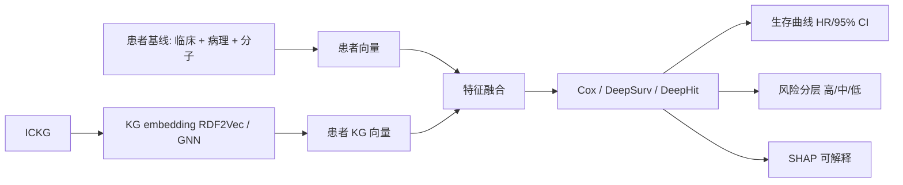

<!--
2.4 Prognosis: Survival and Disease Progression Prediction
2.4 预后：生存与疾病进展评估
-->

# 2.4 预后：生存与疾病进展评估

## 一、应用价值

预后预测连接"治疗决策"与"患者管理"：
- **肿瘤**：5 年生存率、复发风险、进展模式
- **自身免疫病**：疾病活动度（DAS28、SLEDAI）、器官损伤进展
- **造血干细胞移植**：GVHD 风险分层
- **慢性免疫缺陷**：感染累积风险

ICKG 把"免疫状态 → 临床结局"这条因果链结构化，是预后建模的天然知识先验。

## 二、ICKG 适配性

| ICKG 元素 | 预后建模用途 |
|---|---|
| `pathology` (57K) | 病理特征作为预后变量 |
| `phenotype` (166K) | 临床表型、实验室指标 |
| `cell_type` (55K) | TME 细胞组成 → 与生存关联 |
| `results_in` (35K) | 直接因果边，用于构造"结局节点" |
| `treatment_for` + `inhibits` 关系组合 | 治疗-疾病-结局的三联建模 |

## 三、技术路线



**模型选型建议**：

| 模型 | 适用场景 |
|---|---|
| Cox-PH | 基线稳健，可解释 |
| **DeepSurv** | 非线性、可处理高维 |
| **DeepHit** | 多结局竞争风险（OS / PFS / TTNT） |
| **GNN+Survival** ([Ye-2025] 范式) | 与 ICKG 子图直接耦合 |

## 四、最小可执行示例

### DeepSurv + KG 向量（pycox 示例）

```python
# prognosis_deepsurv.py
import argparse, numpy as np, pandas as pd, torch
from pycox.models import CoxPH
from pycox.evaluation import EvalSurv
import torchtuples as tt

def parse_args():
    p = argparse.ArgumentParser(description="基于 ICKG embedding + 临床特征的 DeepSurv 预后预测")
    p.add_argument("--clinical", "-c", required=True, help="临床特征 CSV (含 duration, event 列)")
    p.add_argument("--kg_vec",   "-k", required=True, help="患者 KG 向量 NPY (n_patients × dim)")
    p.add_argument("--out",      "-o", required=True, help="输出目录")
    p.add_argument("--epochs",   "-e", type=int, default=200, help="训练轮数")
    return p.parse_args()

def main():
    a = parse_args()
    clin   = pd.read_csv(a.clinical)
    kg_vec = np.load(a.kg_vec).astype("float32")
    X      = np.hstack([clin.drop(columns=["duration", "event"]).values, kg_vec]).astype("float32")
    y      = (clin["duration"].values.astype("float32"), clin["event"].values.astype("float32"))
    n      = len(X); idx = np.random.permutation(n); cut = int(n * 0.8)
    Xtr, Xte = X[idx[:cut]], X[idx[cut:]]
    ytr      = (y[0][idx[:cut]], y[1][idx[:cut]])
    yte      = (y[0][idx[cut:]], y[1][idx[cut:]])
    net = tt.practical.MLPVanilla(X.shape[1], [128, 64], 1, batch_norm=True, dropout=0.3)
    model = CoxPH(net, tt.optim.Adam(0.001))
    model.fit(Xtr, ytr, batch_size=64, epochs=a.epochs, verbose=False)
    model.compute_baseline_hazards()
    surv = model.predict_surv_df(Xte)
    ev   = EvalSurv(surv, yte[0], yte[1], censor_surv="km")
    print(f"C-index = {ev.concordance_td('antolini'):.4f}")
    model.save_model_weights(f"{a.out}/deepsurv_ickg.pt")

if __name__ == "__main__":
    main()
```

### 示例输入输出

**输入（黑色素瘤患者基线，TCGA-SKCM 风格）**：
```json
{
  "patient_id":   "TCGA-SKCM-XX01",
  "age":          61,
  "stage":        "IIIB",
  "tumor_purity": 0.72,
  "TIL_density":  "high",
  "BRAF_status":  "V600E",
  "treatment":    "anti-PD-1"
}
```

**输出（DeepSurv 风险分层 + 生存曲线）**：

| patient_id | risk_score | 风险分层 | 24m OS 概率 | 60m OS 概率 |
|---|---|---|---|---|
| TCGA-SKCM-XX01 | 0.28 | **低** | 0.86 | 0.71 |
| TCGA-SKCM-XX02 | 0.91 | 高 | 0.42 | 0.18 |
| TCGA-SKCM-XX03 | 0.55 | 中 | 0.69 | 0.45 |

**模型性能（假设值，用于范式说明）**：

| 模型 | C-index | IBS (lower better) |
|---|---|---|
| Cox-PH（仅临床） | 0.65 | 0.18 |
| DeepSurv（仅临床） | 0.69 | 0.17 |
| **DeepSurv（临床 + ICKG 向量）** | **0.74** | **0.14** |

> 与 [Ye-2025](https://doi.org/10.1186/s12885-025-13611-4) 在 SKCM 上 GNN-responseScore 相结合的预后增益方向一致。

---

## 五、文献依据

- ⭐ [Ye-2025] [**Integration of GNN and transcriptomics for immunotherapy response and prognosis in skin melanoma**](https://doi.org/10.1186/s12885-025-13611-4). *BMC Cancer*. 把 GNN 输出转为 responseScore 作为临床预后特征。
- [Rjoob-2026] [**A multimodal vision knowledge graph of cardiovascular disease**](https://doi.org/10.1038/s44161-025-00757-4). *Nat Cardiovasc Res*. 多模态 KG 用于 CVD 风险预测，启示 ICKG 与影像/多组学联合预后。
- [Gao-2025] [**Large language model powered knowledge graph construction for mental health exploration**](https://doi.org/10.1038/s41467-025-62781-z). *Nat Commun*. 范式可平移到"自免活动度"预测。
- [Liu-2023-TMB] [**Biologically informed graph neural network for tumor mutation burden prediction and immunotherapy pathway analysis in gastric cancer**](https://doi.org/10.1016/j.csbj.2023.09.021). *Comput Struct Biotechnol J*. 与预后关联的 TMB-GNN 范式。

## 六、可行性与挑战

| 维度 | 评估 | 说明 |
|---|---|---|
| 数据就绪度 | ★★★ | TCGA、cBioPortal、SEER 等公开生存数据可用 |
| 工程复杂度 | ★★★ | DeepSurv/DeepHit 训练 + 校准 |
| 算力需求 | ★★ | 单 GPU 足够 |
| 主要挑战 | — | **审查偏差**（censoring）；**前瞻验证**需多中心；**校准 vs 区分度**需平衡 |

## 七、推荐深读

- ⭐ [Ye-2025 Melanoma GNN Prognosis](https://doi.org/10.1186/s12885-025-13611-4) — 必读：直接的方法学参考
- ⭐ [Rjoob-2026 CVD Multimodal KG](https://doi.org/10.1038/s44161-025-00757-4) — 多模态扩展的样板
- [Gao-2025 MDKG](https://doi.org/10.1038/s41467-025-62781-z) — 范式可移植到自免活动度

miao!
