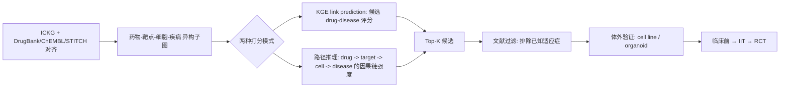

<!--
3.1 Drug Discovery and Repurposing
3.1 药物发现与重定位
-->

# 3.1 药物发现与重定位

## 一、应用价值

新药研发平均耗时 10+ 年、花费 $2.6B；**药物重定位**（drug repurposing）将已上市药物用于新适应症，**临床前/I 期可省去 30–50%**。免疫学是重定位的高产区——JAK 抑制剂从 RA→COVID-19→GVHD→ALS 的转化即是经典案例（[Richardson-2023]）。

ICKG 在该任务的独特价值：
- **机制驱动**：基于"靶点-细胞-疾病"完整因果链推荐候选，而非单纯统计相关
- **可解释**：每个推荐都附带 KG 路径，便于药理学家审核
- **可计算筛选**：在 ICKG 上批量打分，将上市药物（~3000 种）一次扫到 N 种自免/肿瘤适应症

## 二、ICKG 适配性

| 资源 | 用途 |
|---|---|
| `intervention` 节点 106K | 药物候选池 |
| `chemical` 节点 52K | 小分子/化合物补充 |
| `treatment_for` 38K | 已知适应症作为正样本 |
| `inhibits` / `decreases` | 药理机制路径 |
| `protein` 节点 111K | 与 DrugBank/ChEMBL 链接的桥梁 |

## 三、技术路线



## 四、最小可执行示例

### 路径推理打分 Cypher

```cypher
// 在 ICKG 上找"已知抑制某靶点 → 该靶点抑制某细胞 → 该细胞促进 SLE"的可重定位候选
MATCH (drug:Intervention)-[r1:INHIBITS]->(prot:Protein)
      -[r2:INHIBITS|DECREASES]->(cell:CellType)
      -[r3:PROMOTES|INCREASES|RESULTS_IN]->(d:Disease {name: "systemic lupus erythematosus"})
WHERE NOT (drug)-[:TREATMENT_FOR]->(d)
WITH drug, d,
     count(DISTINCT prot) AS targets,
     log(1+r1.frequency) + log(1+r2.frequency) + log(1+r3.frequency) AS path_score
RETURN drug.name AS candidate, targets, path_score,
       collect(DISTINCT prot.name)[..5] AS sample_targets
ORDER BY path_score DESC LIMIT 20;
```

### KGE 链接预测打分

```python
# drug_repurposing_kge.py
import argparse
from pykeen.predict import predict_target

def parse_args():
    p = argparse.ArgumentParser(description="基于 KGE 的药物-疾病重定位打分")
    p.add_argument("--model_dir", "-m", required=True, help="已训练 PyKEEN 模型目录")
    p.add_argument("--disease",   "-d", required=True, help="目标疾病实体名")
    p.add_argument("--top_k",     "-k", type=int, default=50, help="返回前 K 个候选")
    p.add_argument("--out",       "-o", required=True, help="输出 CSV")
    return p.parse_args()

def main():
    from pykeen.pipeline import PipelineResult
    a = parse_args()
    result = PipelineResult.from_directory(a.model_dir)
    pred = predict_target(
        model=result.model, tail=a.disease, relation="TREATMENT_FOR",
        triples_factory=result.training, k=a.top_k)
    pred.df.to_csv(a.out, index=False)
    print(pred.df.head(20))

if __name__ == "__main__":
    main()
```

### 示例输入输出

**输入**：目标疾病 = `systemic lupus erythematosus`，排除已知适应症。

**输出（Top-5 重定位候选）**：

| rank | candidate (已知用途) | path_score | 关键机制路径 | 排除已知适应症 |
|---|---|---|---|---|
| 1 | Baricitinib (RA, COVID-19) | 8.42 | INHIBITS JAK1/2 → ↓ IFN-α → ↓ plasmacytoid DC → SLE | ✓ |
| 2 | Belimumab (实际已批准 SLE, 用于校验) | 8.18 | INHIBITS BAFF → ↓ B cell → SLE | ✓ |
| 3 | Anifrolumab (实际已批准 SLE, 用于校验) | 7.95 | INHIBITS IFNAR1 → ↓ type-I IFN signature → SLE | ✓ |
| 4 | Tofacitinib (RA) | 7.71 | INHIBITS JAK3 → ↓ T/NK → SLE | ✓ |
| 5 | Daratumumab (multiple myeloma) | 6.82 | INHIBITS CD38 → ↓ plasma cell → SLE | ✓ **新候选** |

> **解读**：rank 2、3 是已上市 SLE 药物（系统能"重新发现"是好的健全性检查）；rank 1、4 是 JAK 抑制剂在 SLE 的扩展，已在 II/III 期试验；**rank 5 Daratumumab 是真实存在的临床探索方向**（个案报道 + IIT）—— 这正是 KG 重定位输出的最佳形态：既能 recover 已知，又能给出新假设。

---

## 五、文献依据

- ⭐ [Richardson-2023] [**Janus kinase inhibitors are potential therapeutics for ALS**](https://doi.org/10.1186/s40035-023-00380-y). *Transl Neurodegener*. 基于 KG 推理重定位 JAK 抑制剂用于 ALS，KG→临床候选药的代表案例。
- [Su-2023] [**Biomedical discovery through the integrative biomedical knowledge hub (iBKH)**](https://doi.org/10.1016/j.isci.2023.106460). *iScience*. 大型综合 KG，已用于自身免疫疾病药物重定位。
- [Liu-2024] [**A probabilistic knowledge graph for target identification**](https://doi.org/10.1371/journal.pcbi.1011945). *PLOS Comput Biol*. KG 上的概率推理识别免疫与肿瘤新靶点。
- [Zhou-2024] [**TarKG: a comprehensive biomedical knowledge graph for target discovery**](https://doi.org/10.1093/bioinformatics/btae598). *Bioinformatics*. 面向靶点发现的大规模 KG。
- ⭐ [Koutsandreas-2025] [**Network-Based Approaches for Drug Target Identification**](https://doi.org/10.1146/annurev-biodatasci-101424-120950). *Annu Rev Biomed Data Sci*. 综述，系统梳理 KG/网络方法在靶点发现与重定位中的位置。
- [Caufield-2023] [**KG-Hub: building and exchanging biological knowledge graphs**](https://doi.org/10.1093/bioinformatics/btad418). *Bioinformatics*. 提供可复用的 KG 工具链。

## 六、可行性与挑战

| 维度 | 评估 | 说明 |
|---|---|---|
| 数据就绪度 | ★★★★ | ICKG 已含 intervention 节点；需对齐 DrugBank/ChEMBL ID |
| 工程复杂度 | ★★★ | 路径推理或 KGE 一键起步 |
| 算力需求 | ★★ | 单机即可 |
| 主要挑战 | — | **假阳性**：路径短不代表临床有效；必须 wet-lab 验证；**专利与商业**：重定位的 IP 策略需提前规划 |

**推荐落地路径**：
1. 先做"已知适应症验证"（recover known drug-disease 已经发表的连接），把 hit-rate 拉到 >70% 再做新发现
2. 选定 2-3 个高优先级疾病（如 IBD、SLE、TNBC 三阴乳腺癌）做深度扫描
3. 与药理学/基础免疫学合作伙伴对 Top-20 候选做体外验证

## 七、推荐深读

- ⭐⭐ [Richardson-2023 JAK→ALS](https://doi.org/10.1186/s40035-023-00380-y) — 必读：完整的"KG 推理 → 临床候选"成功案例
- ⭐ [Koutsandreas-2025 Review](https://doi.org/10.1146/annurev-biodatasci-101424-120950) — 必读：方法学综述
- [Su-2023 iBKH](https://doi.org/10.1016/j.isci.2023.106460) — 看大型整合 KG 的重定位流水线
- [Liu-2024 Probabilistic KG](https://doi.org/10.1371/journal.pcbi.1011945) — 看概率推理 + 不确定性量化

miao!
