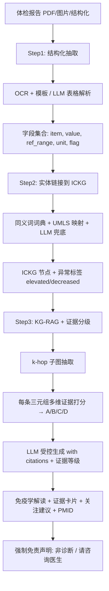

<!--
3.1 Health / Immune Report Interpretation (Flagship Scenario)
3.1 健康/免疫报告解读（旗舰场景）—— 含多维证据可靠性分级框架
-->

# 3.1 健康/免疫报告解读 ⭐ 旗舰场景

> 这是老师特别感兴趣的场景。本篇在"能不能用 ICKG 解读报告"之外，重点深化两件事：
> ① **多维证据可靠性分级框架**（第五节）——把每条解读的可信度从单一"抽取打分 score"升级为频次/时效/期刊水平/与临床证据吻合度/研究类型(GRADE)/矛盾检测的综合 **A/B/C/D 分级**；
> ② **更深一层的产品化**（第六节）——纵向追踪、风险红黄绿灯分层、多模态融合与合规边界。

## 一、应用价值

体检报告中**免疫相关指标常常被忽视或误读**：
- 淋巴细胞亚群（CD3/CD4/CD8/CD19/NK%）
- 免疫球蛋白（IgG/IgA/IgM/IgE）
- 补体（C3/C4）
- 细胞因子谱（IL-6/IL-10/TNF-α/IFN-γ）
- 自身抗体（ANA/dsDNA/ENA 谱）
- 流式细胞数据（特检）
- 肿瘤标志物（CEA/CA199/AFP/...）

医生面诊时间有限，普通患者更无能力理解。**ICKG-RAG 系统可以提供"个体化、可追溯、有边界"的免疫学解读**：把每个异常指标链接到 ICKG 的 `phenotype/protein/cell_type` 节点，沿 `help_identify/associated_with/results_in` 关系给出可能含义、需要进一步关注的方向，并附文献来源（PMID）。

## 二、ICKG 适配性

| 报告项类型 | ICKG 节点类型 | 例 |
|---|---|---|
| 细胞计数/比例 | `cell_type` + `phenotype` | "CD8+ T cell" + "elevated" |
| 蛋白/细胞因子浓度 | `protein` + `phenotype` | "IL-6" + "elevated serum level" |
| 自身抗体 | `protein` + `help_identify` | "anti-dsDNA antibody" |
| 肿瘤标志物 | `protein` + `help_identify` | "CEA" → "colorectal carcinoma" |
| 影像/病理描述 | `pathology` | "chronic inflammation" |

## 三、技术路线（三步走）



> 与旧版相比，新增 **Step3 中的"证据分级"环节**：抓出子图后，先给每条候选三元组算一个多维可靠性分数并定级，再让大模型**按证据强弱措辞**（A 级可肯定、D 级仅作探索提示）。详见第五节。

## 四、最小可执行示例

### 端到端最小骨架

```python
# health_report_interpreter.py
import argparse, json
from pdf_parse import extract_lab_fields                # 自定义: OCR + 表格解析
from entity_link import link_to_ickg                    # 自定义: 实体规范化
from kg_subgraph import extract_subgraph_with_flags     # 自定义: 抓 k-hop 子图
from evidence_grading import grade_subgraph             # 自定义: 多维证据分级(见第五节)
from llm_generate import generate_interpretation        # 自定义: 受控生成

DISCLAIMER = """
【重要免责声明】本报告由 ICKG 知识图谱 + AI 生成，仅作为个人健康参考与
科普阅读，不能替代专业医生的诊断与治疗建议。如指标异常或有不适，请尽快
就诊。所有结论均附文献来源 (PMID)，便于您与医生进一步讨论。
"""

def parse_args():
    p = argparse.ArgumentParser(description="基于 ICKG 的健康报告免疫学解读")
    p.add_argument("--report", "-r", required=True, help="体检报告路径 (PDF/图片/JSON)")
    p.add_argument("--mode",   "-m", default="patient", choices=["patient", "doctor"],
                   help="解读模式: patient(科普) / doctor(专业)")
    p.add_argument("--out",    "-o", required=True, help="输出 Markdown 路径")
    p.add_argument("--khop",   "-k", type=int, default=2, help="子图扩展跳数")
    p.add_argument("--min-grade", default="C", choices=["A", "B", "C", "D"],
                   help="纳入解读的最低证据等级（默认 C，即丢弃 D 级仅探索性证据）")
    p.add_argument("--weights", default=None,
                   help="证据各维度权重 JSON（不填用默认；见第五节复合公式）")
    return p.parse_args()

def main():
    a = parse_args()
    # Step 1: 抽取字段
    fields = extract_lab_fields(a.report)
    # Step 2: 实体链接 (只关心异常项, flag != normal)
    abnormal = [f for f in fields if f["flag"] != "normal"]
    nodes = link_to_ickg(abnormal)
    # Step 3: 抓子图 → 多维证据分级 → 受控生成
    subg = extract_subgraph_with_flags(nodes, k_hop=a.khop)
    subg = grade_subgraph(subg, weights=a.weights, min_grade=a.min_grade)  # 见第五节
    text = generate_interpretation(subg, mode=a.mode,
                                   with_pmid_citations=True, show_evidence_grade=True)
    # 强制拼接免责声明
    with open(a.out, "w", encoding="utf-8") as fp:
        fp.write(text + "\n\n---\n" + DISCLAIMER)

if __name__ == "__main__":
    main()
```

### 示例输入输出

**输入（结构化）**：
```json
[
  {"item": "CD4/CD8 ratio", "value": 0.8, "ref_range": "1.4-2.0", "flag": "decreased"},
  {"item": "IL-6",          "value": 24.3, "ref_range": "<7.0",   "unit": "pg/mL", "flag": "elevated"},
  {"item": "anti-dsDNA Ab", "value": 145,  "ref_range": "<100",   "unit": "IU/mL", "flag": "elevated"}
]
```

**输出（患者模式节选）**：
> **解读：**
> 您的 CD4/CD8 比值偏低（0.8，参考范围 1.4–2.0），同时血清 IL-6 升高（24.3 pg/mL，参考 <7.0），抗 dsDNA 抗体阳性（145 IU/mL）。
>
> 根据 ICKG 的多跳关联推理：
> - CD4/CD8 比值倒置常见于慢性病毒感染、自身免疫疾病活动期 [PMID: xxxxxxx]
> - IL-6 升高 + 抗 dsDNA 阳性的组合与 **系统性红斑狼疮活动期** 有较强关联 [PMID: yyyyyyy]
> - 建议与风湿免疫科医生沟通，补充 SLEDAI 评分、补体 C3/C4、抗 Sm 抗体等检查
>
> 【免责声明】… (略)

## 五、证据可靠性分级框架 ⭐（核心深化）

### 5.1 为什么"抽取打分 score"远远不够

当前对每条三元组，模型抽取时会给一个 `extraction_score`，它只回答了**"模型有没有抽对这句话"**，却没有回答更关键的**"这句话本身在科学上有多可靠"**。一条只被一篇会议摘要提到、十年前、且与最新指南相左的关联，和一条被几十篇 Q1 期刊队列研究反复证实、且写进临床指南的关联，`extraction_score` 可能一样高——但用于个人报告解读时，二者的份量天差地别。

> KG 社区的可信度标准（[KG-Quality-2025](https://arxiv.org/abs/2508.21774)）强调：可信知识图谱需要 **provenance、版本、更新频率、证据质量** 等多维证据；[BioKGrapher](https://doi.org/10.1016/j.csbj.2024.10.017) 进一步建议用**文献计量学（研究阶段、证据等级、发表时效）**来对齐临床指南。临床领域的证据分级金标准则是 **GRADE**（[Guyatt-2008](https://doi.org/10.1136/bmj.39489.470347.AD)，把证据定为高/中/低/极低四级）。本框架即把这三者落到 ICKG 的每条边上。

### 5.2 七个证据维度

| 维度 | 含义 | 取值 / 数据来源 | 作用 |
|---|---|---|---|
| `extraction_score` 抽取置信度 | 模型抽取该三元组的把握 | 0–1（已有） | 基础门槛，过低直接弃用 |
| `freq` 证据频次 | 支持该三元组的**独立 PMID** 数 | 整数（边属性 `pmids` 已存） | 重复性越高越可信 |
| `recency` 时效性 | 证据新旧 | 由 `pmids` 年份算：近 5 年加权，老而被反复复现亦加权 | 防止"过时关联" |
| `journal` 期刊水平 | 支持文献的期刊层级 | JIF / SJR / JCR 分区（外接期刊表） | 高水平期刊证据加权 |
| `clinical_fit` 与临床证据吻合度 | 与指南/RCT/权威库一致度 | 0–1（对齐临床指南、DrugBank、ClinVar 等） | 与临床金标准一致则升级 |
| `study_grade` 研究类型等级 | 支持文献的研究设计层级 | RCT > 队列 > 病例对照 > 个案 > 综述/观点，映射 **GRADE 高/中/低/极低** | 证据金字塔层级 |
| `consistency` 一致性 | 是否存在矛盾三元组 | 检测 `increases` vs `decreases` 等正反冲突 | 命中矛盾则**降级并显式提示** |

### 5.3 复合评分与 A/B/C/D 综合分级

所有权重均作为**命令行参数**暴露（默认值仅作起点，可按场景调参）：

$$
\text{EvidenceScore} = \Big(\sum_{i} w_i \cdot \widetilde{x_i}\Big)\cdot \underbrace{(1-\lambda\cdot \text{conflict})}_{\text{矛盾惩罚}},\quad
\widetilde{x_i}\in[0,1]\ \text{为各维归一化值}
$$

其中各维归一化建议：`freq` 取 $\log(1+\text{freq})$ 后归一；`recency` 用时间衰减 $\gamma^{\,\text{years}}$ 再叠加"长期复现"奖励；`journal`/`study_grade` 用分档映射到 0–1；`clinical_fit` 直接 0–1。综合得分对齐 GRADE 映射为四级：

| 综合等级 | 标识 | 对齐 GRADE | 典型条件 | 解读措辞策略 |
|---|---|---|---|---|
| **A 高** | ⭐⭐⭐ | High | 高分 + 无矛盾 + 含 RCT/队列 + 与指南一致 | 可较肯定陈述 |
| **B 中** | ⭐⭐ | Moderate | 多篇支持但研究层级中等 / 期刊一般 | "较强提示，建议结合临床" |
| **C 低** | ⭐ | Low | 证据零散、时效偏旧、或层级低 | "有限证据，需进一步证实" |
| **D 极低/探索** | ⚠ | Very Low | `freq=1`、仅个案/观点、或存在未解决矛盾 | 默认不进入患者解读，仅医生模式作探索提示 |

> 默认 `--min-grade C`：D 级证据不进入面向患者的解读，避免用一条孤证吓到用户。

### 5.4 评分函数骨架（权重可配）

```python
# evidence_grading.py  —— 对子图每条三元组打多维证据分并定级
import argparse, json, math, datetime

DEFAULT_W = {"extraction": 0.15, "freq": 0.20, "recency": 0.15,
             "journal": 0.15, "clinical_fit": 0.20, "study_grade": 0.15}
GRADE_BINS = [(0.80, "A"), (0.60, "B"), (0.40, "C"), (0.0, "D")]

def _recency(years, gamma=0.92):
    """时间衰减 + 长期复现奖励：取最近一篇与跨度共同决定。"""
    if not years: return 0.0
    now = datetime.date.today().year
    fresh = gamma ** (now - max(years))            # 越新越高
    span_bonus = min(len(set(years)) / 10.0, 0.3)  # 跨年份复现奖励
    return min(fresh + span_bonus, 1.0)

def score_triple(t, w):
    """t: 含 extraction_score / pmids / journal_q / clinical_fit / study_grade / conflict 字段"""
    x = {
        "extraction":  t["extraction_score"],
        "freq":        min(math.log1p(len(t["pmids"])) / math.log(50), 1.0),
        "recency":     _recency([p["year"] for p in t["pmids"]]),
        "journal":     {"Q1":1.0,"Q2":0.75,"Q3":0.5,"Q4":0.25}.get(t["journal_q"], 0.4),
        "clinical_fit": t["clinical_fit"],
        "study_grade": {"RCT":1.0,"cohort":0.8,"case_control":0.6,
                        "case_report":0.3,"review":0.4}.get(t["study_grade"], 0.4),
    }
    base = sum(w[k] * x[k] for k in w)
    s = base * (1 - 0.5 * t.get("conflict", 0))     # 矛盾惩罚
    grade = next(g for thr, g in GRADE_BINS if s >= thr)
    return round(s, 3), grade

def grade_subgraph(subg, weights=None, min_grade="C"):
    w = {**DEFAULT_W, **(json.loads(weights) if weights else {})}
    order = {"A":0,"B":1,"C":2,"D":3}
    for tri in subg["triples"]:
        tri["evidence_score"], tri["evidence_grade"] = score_triple(tri, w)
    subg["triples"] = [t for t in subg["triples"]
                       if order[t["evidence_grade"]] <= order[min_grade]]
    return subg
```

### 5.5 输出形态：证据卡片

把分级直接呈现给用户/医生，让每条结论都"亮明底牌"：

```
结论：IL-6 升高 + 抗 dsDNA 阳性  ↔  系统性红斑狼疮活动期
证据等级：A（高）⭐⭐⭐        EvidenceScore = 0.86
├─ 支持文献：37 篇独立 PMID（近 5 年 21 篇）
├─ 期刊水平：含 Ann Rheum Dis / Nat Rev Rheumatol 等 Q1
├─ 研究类型：2 项队列 + 1 项 RCT 亚组（GRADE: 高）
├─ 与临床证据吻合：与 EULAR SLE 管理指南一致 ✓
└─ 一致性：未发现矛盾证据
```

对照一条弱证据：

```
结论：某细胞因子 X ↔ 某罕见表型 Y
证据等级：D（极低）⚠         EvidenceScore = 0.28
├─ 支持文献：1 篇个案报道（2014）
├─ 期刊水平：Q4
├─ 研究类型：case report（GRADE: 极低）
└─ ⚠ 与另一条三元组存在方向冲突 —— 默认不进入患者解读
```

> 让大模型在生成时读取 `evidence_grade`，**按等级调措辞**：A 级可肯定，C 级用"有限证据提示"，D 级在患者模式下直接隐去。这把"可追溯"再往前推了一步——不仅能追溯到 PMID，还能**量化告诉用户这条结论有多硬**。

## 六、更深一层：纵向追踪 · 风险分层 · 多模态 · 合规

1. **个体纵向追踪**：报告解读不应只看单次快照。把同一用户多次体检的免疫指标做**时间序列趋势**（如 IL-6 连续 3 次走高、CD4/CD8 持续下滑），ICKG 提供"趋势→可能机制"的解释，比单点更有预警价值，并与 [3.2 免疫韧性画像](./3.2_immune_resilience_profiling.md) 打通。
2. **风险红黄绿灯分层 + 红灯前置**：对每份报告输出三色分层——🟢 正常/无需担心、🟡 建议关注/择期复查、🔴 需尽快就医（如多项强证据指向活动性自身免疫/肿瘤信号）。**红灯信息前置展示**、措辞模板化，避免恐慌也避免漏报。
3. **多模态融合（展望）**：把可穿戴（HRV、睡眠、活动量）与组学（单细胞/流式）数据与报告字段一起链接到 ICKG，做更立体的免疫健康画像（参考 [Rjoob-2026](https://doi.org/10.1038/s44161-025-00757-4) 多模态 KG 思路）。
4. **合规与心理边界**：强制"非诊断"定位与免责声明；D 级证据不进患者解读；涉及患者数据遵守《个人信息保护法》/HIPAA/GDPR；必要时人工审核 🔴 红灯输出。

## 七、文献依据

- ⭐ [Guyatt-2008] [**GRADE: an emerging consensus on rating quality of evidence and strength of recommendations**](https://doi.org/10.1136/bmj.39489.470347.AD). *BMJ*. 临床证据分级金标准，本框架 A/B/C/D 综合分级的对齐基准。
- ⭐ [KG-Quality-2025] [**Improving Biomedical Knowledge Graph Quality: A Community Approach**](https://arxiv.org/abs/2508.21774). *arXiv*. KG 可信度社区标准（provenance/版本/更新/证据质量），本框架多维证据设计的依据。
- [Schäfer-2024] [**BioKGrapher: Initial evaluation of automated knowledge graph construction from biomedical literature**](https://doi.org/10.1016/j.csbj.2024.10.017). *Comput Struct Biotechnol J*. 明确建议用研究阶段、证据等级、发表时效等文献计量学对齐临床指南。
- ⭐ [Liu-2025-JAMIA] [**Detecting emergencies in patient portal messages using LLMs and KG-based RAG**](https://doi.org/10.1093/jamia/ocaf059). *JAMIA*. 真实部署的 KG-RAG 提升消息分诊安全性；本场景的临床落地范例。
- ⭐ [Hu-2025] [**A self-correcting Agentic Graph RAG for clinical decision support in hepatology**](https://doi.org/10.3389/fmed.2025.1716327). *Front Med*. 专科 Graph RAG + Agent 自校正，可迁移到免疫科报告解读。
- [Kim-2026] [**MedSumGraph: enhancing GraphRAG for medical QA with summarization and optimized prompts**](https://doi.org/10.1016/j.artmed.2025.103311). *Artif Intell Med*. 针对医学问答优化的子图摘要 + 提示构造。
- [Gao-2025-Dx] [**Leveraging Medical Knowledge Graphs Into Large Language Models for Diagnosis Prediction**](https://doi.org/10.2196/58670). *JMIR AI*. KG-augmented LLM 在诊断辅助的方法学比较。
- [Soman-2024] [**Biomedical knowledge graph-optimized prompt generation for large language models**](https://doi.org/10.1093/bioinformatics/btae560). *Bioinformatics*. SPOKE-KG-RAG 框架。

## 八、可行性与挑战

| 维度 | 评估 | 说明 |
|---|---|---|
| 数据就绪度 | ★★★★ | KG 就绪；体检报告格式多样，需建模板库；证据分级需外接期刊分区表与指南/权威库 |
| 工程复杂度 | ★★★ | OCR/解析 + 实体链接 + 证据分级 + KG-RAG 四段式 |
| 算力需求 | ★★ | 主要是 LLM API 成本 |
| 主要挑战 | — | **法律边界**：必须明确"非诊断"定位、明确免责声明、必要时人工审核；**证据分级权重需校准**（与专家判断对齐）；**报告版式多样**：OCR 容错；**心理影响**：避免引起患者恐慌（措辞模板化、🔴 红灯前置警示） |

**两种产品形态**：
- **B2C 直面消费者**：科普向，强免责，重点是引导就医
- **B2B 给医院/体检中心**：专业向，作为医生工作助手，整合到 PACS/LIS

## 九、推荐深读

- ⭐⭐ [Guyatt-2008 GRADE](https://doi.org/10.1136/bmj.39489.470347.AD) — 必读：证据分级金标准，A/B/C/D 的来源
- ⭐ [KG-Quality-2025 社区标准](https://arxiv.org/abs/2508.21774) — KG 可信度多维评估
- ⭐ [Schäfer-2024 BioKGrapher](https://doi.org/10.1016/j.csbj.2024.10.017) — 文献计量学对齐指南
- ⭐⭐ [Liu-2025 JAMIA Triage](https://doi.org/10.1093/jamia/ocaf059) — 必读：唯一真实部署的同类系统
- ⭐⭐ [Hu-2025 Hepatology Agent](https://doi.org/10.3389/fmed.2025.1716327) — 必读：专科场景端到端实现
- [Gao-2025-Dx](https://doi.org/10.2196/58670) — KG-LLM 设计选择对比
- [Soman-2024 SPOKE-RAG](https://doi.org/10.1093/bioinformatics/btae560) — KG-RAG 奠基

miao!
