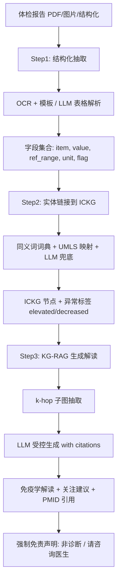

<!--
3.2 Health Report Interpretation (Flagship Scenario)
3.2 健康/体检报告免疫学解读（旗舰场景）
-->

# 3.2 健康/体检报告免疫学解读 ⭐ 旗舰场景

> 这是用户在原始需求中明确点名的"能不能用 ICKG 解读健康报告"的场景。

## 一、应用价值

体检报告中**免疫相关指标常常被忽视或误读**：
- 淋巴细胞亚群（CD3/CD4/CD8/CD19/NK%）
- 免疫球蛋白（IgG/IgA/IgM/IgE）
- 补体（C3/C4）
- 细胞因子谱（IL-6/IL-10/TNF-α/IFN-γ）
- 自身抗体（ANA/dsDNA/ENA 谱）
- 流式细胞数据（特检）
- 肿瘤标志物（CEA/CA199/AFP/...）

医生面诊时间有限，普通患者更无能力理解。**ICKG-RAG 系统可以提供"个体化、可追溯、有边界"的免疫学解读**：把每个异常指标链接到 ICKG 的 `phenotype/protein/cell_type` 节点，沿 `help_identify/associated_with/results_in` 关系给出可能含义、需要进一步关注的方向，并附文献来源（PMID）。

## 二、ICKG 适配性

| 报告项类型 | ICKG 节点类型 | 例 |
|---|---|---|
| 细胞计数/比例 | `cell_type` + `phenotype` | "CD8+ T cell" + "elevated" |
| 蛋白/细胞因子浓度 | `protein` + `phenotype` | "IL-6" + "elevated serum level" |
| 自身抗体 | `protein` + `help_identify` | "anti-dsDNA antibody" |
| 肿瘤标志物 | `protein` + `help_identify` | "CEA" → "colorectal carcinoma" |
| 影像/病理描述 | `pathology` | "chronic inflammation" |

## 三、技术路线（三步走）



## 四、最小可执行示例

### 端到端最小骨架

```python
# health_report_interpreter.py
import argparse, json
from pdf_parse import extract_lab_fields                # 自定义: OCR + 表格解析
from entity_link import link_to_ickg                    # 自定义: 实体规范化
from kg_subgraph import extract_subgraph_with_flags     # 自定义: 抓 k-hop 子图
from llm_generate import generate_interpretation        # 自定义: 受控生成

DISCLAIMER = """
【重要免责声明】本报告由 ICKG 知识图谱 + AI 生成，仅作为个人健康参考与
科普阅读，不能替代专业医生的诊断与治疗建议。如指标异常或有不适，请尽快
就诊。所有结论均附文献来源 (PMID)，便于您与医生进一步讨论。
"""

def parse_args():
    p = argparse.ArgumentParser(description="基于 ICKG 的健康报告免疫学解读")
    p.add_argument("--report", "-r", required=True, help="体检报告路径 (PDF/图片/JSON)")
    p.add_argument("--mode",   "-m", default="patient", choices=["patient", "doctor"],
                   help="解读模式: patient(科普) / doctor(专业)")
    p.add_argument("--out",    "-o", required=True, help="输出 Markdown 路径")
    p.add_argument("--khop",   "-k", type=int, default=2, help="子图扩展跳数")
    return p.parse_args()

def main():
    a = parse_args()
    # Step 1: 抽取字段
    fields = extract_lab_fields(a.report)
    # Step 2: 实体链接 (只关心异常项, flag != normal)
    abnormal = [f for f in fields if f["flag"] != "normal"]
    nodes = link_to_ickg(abnormal)
    # Step 3: 抓子图 + 生成
    subg = extract_subgraph_with_flags(nodes, k_hop=a.khop)
    text = generate_interpretation(subg, mode=a.mode, with_pmid_citations=True)
    # 强制拼接免责声明
    with open(a.out, "w", encoding="utf-8") as fp:
        fp.write(text + "\n\n---\n" + DISCLAIMER)

if __name__ == "__main__":
    main()
```

### 示例输入输出

**输入（结构化）**：
```json
[
  {"item": "CD4/CD8 ratio", "value": 0.8, "ref_range": "1.4-2.0", "flag": "decreased"},
  {"item": "IL-6",          "value": 24.3, "ref_range": "<7.0",   "unit": "pg/mL", "flag": "elevated"},
  {"item": "anti-dsDNA Ab", "value": 145,  "ref_range": "<100",   "unit": "IU/mL", "flag": "elevated"}
]
```

**输出（患者模式节选）**：
> **解读：**
> 您的 CD4/CD8 比值偏低（0.8，参考范围 1.4–2.0），同时血清 IL-6 升高（24.3 pg/mL，参考 <7.0），抗 dsDNA 抗体阳性（145 IU/mL）。
>
> 根据 ICKG 的多跳关联推理：
> - CD4/CD8 比值倒置常见于慢性病毒感染、自身免疫疾病活动期 [PMID: xxxxxxx]
> - IL-6 升高 + 抗 dsDNA 阳性的组合与 **系统性红斑狼疮活动期** 有较强关联 [PMID: yyyyyyy]
> - 建议与风湿免疫科医生沟通，补充 SLEDAI 评分、补体 C3/C4、抗 Sm 抗体等检查
>
> 【免责声明】… (略)

## 五、文献依据

- ⭐ [Liu-2025-JAMIA] [**Detecting emergencies in patient portal messages using LLMs and KG-based RAG**](https://doi.org/10.1093/jamia/ocaf059). *JAMIA*. 真实部署的 KG-RAG 提升消息分诊安全性；本场景的临床落地范例。
- ⭐ [Hu-2025] [**A self-correcting Agentic Graph RAG for clinical decision support in hepatology**](https://doi.org/10.3389/fmed.2025.1716327). *Front Med*. 专科 Graph RAG + Agent 自校正，可迁移到免疫科报告解读。
- [Kim-2026] [**MedSumGraph: enhancing GraphRAG for medical QA with summarization and optimized prompts**](https://doi.org/10.1016/j.artmed.2025.103311). *Artif Intell Med*. 针对医学问答优化的子图摘要 + 提示构造。
- [Gao-2025-Dx] [**Leveraging Medical Knowledge Graphs Into Large Language Models for Diagnosis Prediction**](https://doi.org/10.2196/58670). *JMIR AI*. KG-augmented LLM 在诊断辅助的方法学比较。
- [Soman-2024] [**Biomedical knowledge graph-optimized prompt generation for large language models**](https://doi.org/10.1093/bioinformatics/btae560). *Bioinformatics*. SPOKE-KG-RAG 框架。

## 六、可行性与挑战

| 维度 | 评估 | 说明 |
|---|---|---|
| 数据就绪度 | ★★★★ | KG 就绪；体检报告格式多样，需建模板库 |
| 工程复杂度 | ★★★ | OCR/解析 + 实体链接 + KG-RAG 三段式 |
| 算力需求 | ★★ | 主要是 LLM API 成本 |
| 主要挑战 | — | **法律边界**：必须明确"非诊断"定位、明确免责声明、必要时人工审核；**报告版式多样**：OCR 容错；**心理影响**：避免引起患者恐慌（措辞模板化、设置"红灯"前置警示） |

**两种产品形态**：
- **B2C 直面消费者**：科普向，强免责，重点是引导就医
- **B2B 给医院/体检中心**：专业向，作为医生工作助手，整合到 PACS/LIS

## 七、推荐深读

- ⭐⭐ [Liu-2025 JAMIA Triage](https://doi.org/10.1093/jamia/ocaf059) — 必读：唯一真实部署的同类系统
- ⭐⭐ [Hu-2025 Hepatology Agent](https://doi.org/10.3389/fmed.2025.1716327) — 必读：专科场景端到端实现
- ⭐ [Kim-2026 MedSumGraph](https://doi.org/10.1016/j.artmed.2025.103311) — 提示与摘要工程
- [Gao-2025-Dx](https://doi.org/10.2196/58670) — KG-LLM 设计选择对比
- [Soman-2024 SPOKE-RAG](https://doi.org/10.1093/bioinformatics/btae560) — KG-RAG 奠基

miao!
