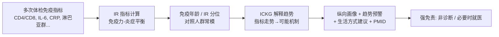

<!--
3.2 Immune Resilience Profiling and Longitudinal Tracking
3.2 免疫韧性画像与纵向追踪
-->

# 3.2 免疫韧性画像与纵向追踪

> **使用场景 / 解决的问题**：体检只给一堆"单次、孤立"的免疫指标，普通人无法据此判断"我的免疫力到底强不强、在变好还是变差"。本场景把多次体检的免疫指标合成一个**可解释的「免疫韧性 / 免疫年龄」画像**并**纵向追踪趋势**，让免疫健康像体重、血压一样可被长期管理。

## 一、应用价值

"免疫韧性（immune resilience, IR）"指**在衰老与炎症压力下，仍能维持/快速恢复免疫功能的能力**。[Ahuja-2023](https://doi.org/10.1038/s41467-023-38238-6) 在约 4.85 万人上证明：用两个外周血指标量化的最佳 IR，与更低的 HIV/流感/复发性皮肤癌风险、COVID-19 与脓毒症的生存优势、以及长寿相关，并指出 **IR 指标既可作"免疫健康"的生物标志物，也可作为改善健康结局的抓手**。[Manoharan-2025](https://doi.org/10.1111/acel.70063) 进一步发现以 TCF7 为核心的 IR 可对抗"炎性衰老 + 免疫衰老 + 细胞衰老"三大机制，中年（40–70 岁）是 IR 干预的关键窗口。

> 个人价值：把"看不见的免疫力"变成一个**可量化、可追踪、可对照人群分位**的画像，回答"我现在免疫力如何 / 在变好还是变差 / 该不该干预"。

## 二、ICKG 适配性

| 画像维度 | ICKG 提供 | 用途 |
|---|---|---|
| 免疫细胞组分 | `cell_type`（55K，CD8/CD4/Treg/NK…） | 把淋巴细胞亚群指标链到机制层 |
| 炎症因子 | `protein/phenotype`（IL-6/TNF-α/CRP…） | inflammaging 相关因子解释 |
| "因子/细胞→结局"因果 | `results_in`/`promotes`/`inhibits` | 解释某指标走势对应的可能后果 |
| 文献来源 | 每边 `pmids` | 画像的每条解释都可追溯 |

## 三、技术路线



## 四、最小可执行示例

```python
# immune_resilience_profile.py
# 英文/中文：根据多次体检免疫指标计算免疫韧性画像并追踪趋势
import argparse, json, numpy as np

def parse_args():
    p = argparse.ArgumentParser(description="基于 ICKG 的免疫韧性画像与纵向追踪")
    p.add_argument("--records", "-r", required=True, help="同一用户多次体检的免疫指标 JSON（按时间排序）")
    p.add_argument("--norm",    "-n", required=True, help="人群常模文件（按年龄/性别给分位）")
    p.add_argument("--out",     "-o", required=True, help="输出画像 Markdown 路径")
    p.add_argument("--ir-weights", default=None, help="IR 各分量权重 JSON（可选）")
    return p.parse_args()

def immune_resilience(rec, w):
    """免疫力-炎症平衡：免疫力分量(如 CD8/CD4 平衡、淋巴亚群) - 炎症分量(IL-6/CRP)。"""
    competence = w["cd"] * rec["cd8_cd4_balance"] + w["lymph"] * rec["lymph_score"]
    inflammation = w["il6"] * rec["IL6"] + w["crp"] * rec["CRP"]
    return competence - inflammation

def main():
    a = parse_args()
    w = {"cd":0.4,"lymph":0.3,"il6":0.2,"crp":0.1, **(json.loads(a.ir_weights) if a.ir_weights else {})}
    recs = json.load(open(a.records, encoding="utf-8"))
    series = [(r["date"], immune_resilience(r, w)) for r in recs]
    trend = "↑ 改善" if series[-1][1] > series[0][1] else "↓ 下降需关注"
    print("免疫韧性趋势：", trend)
    # 实际实现：对照 norm 给分位 + 用 ICKG 解释每个异常走势 + 生成建议
    # ...

if __name__ == "__main__":
    main()
```

### 示例输出（节选）

> **您的免疫韧性画像（近 3 次体检）**
> - 免疫韧性分位：**第 38%**（同龄同性别），较 1 年前（第 52%）**下降** ↓
> - 主要驱动：血清 IL-6 连续 3 次走高（5.1 → 12.4 → 18.7 pg/mL），CD4/CD8 由 1.6 降至 1.1
> - ICKG 解释：持续 IL-6 升高与"炎性衰老（inflammaging）"相关 [PMID: …]，建议关注慢性炎症来源
> - 建议方向：复查炎症来源、改善睡眠/运动/代谢；中年是 IR 干预关键窗口
> 【免责声明】本画像为健康管理参考，非诊断；若持续异常请就医。

## 五、文献依据

- ⭐⭐ [Ahuja-2023] [**Immune resilience despite inflammatory stress promotes longevity and favorable health outcomes**](https://doi.org/10.1038/s41467-023-38238-6). *Nat Commun*. 提出可量化的免疫韧性指标，证明其作为"免疫健康生物标志物"的价值。
- ⭐ [Manoharan-2025] [**The 15-Year Survival Advantage: Immune Resilience as a Salutogenic Force in Healthy Aging**](https://doi.org/10.1111/acel.70063). *Aging Cell*. TCF7 为核心的 IR 对抗炎性/免疫/细胞衰老，中年是干预窗口。
- [Cui-2024] [**Dictionary of immune responses to cytokines at single-cell resolution**](https://doi.org/10.1038/s41586-023-06816-9). *Nature*. 细胞因子-免疫细胞应答金标准，可校准画像的机制解释。

## 六、可行性与挑战

| 维度 | 评估 | 说明 |
|---|---|---|
| 数据就绪度 | ★★★ | ICKG 就绪；需要**纵向**体检数据与人群常模 |
| 工程复杂度 | ★★ | 指标计算 + 趋势 + ICKG 解释 |
| 算力需求 | ★ | 单机即可 |
| 主要挑战 | — | **IR 指标本地化校准**（人群常模差异）；**非诊断边界**；与 [3.1 报告解读](./3.1_health_report_interpretation.md) 共用实体链接与证据分级 |

## 七、推荐深读

- ⭐⭐ [Ahuja-2023 Immune Resilience](https://doi.org/10.1038/s41467-023-38238-6) — 必读：IR 指标定义与验证
- ⭐ [Manoharan-2025 IR & Aging](https://doi.org/10.1111/acel.70063) — IR 与健康衰老、干预窗口

miao!
