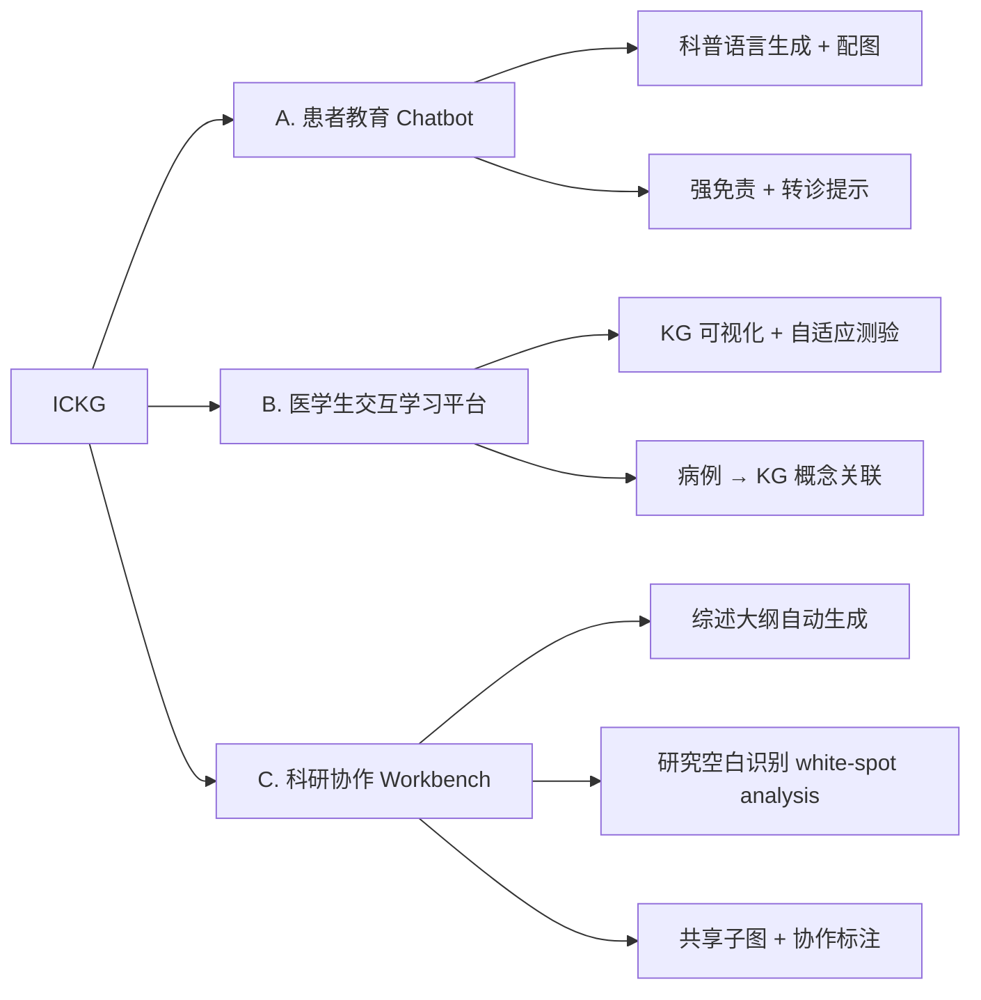

<!--
3.3 Education, Patient Education, and Research Collaboration
3.3 教育、患教与科研协作
-->

# 3.3 教育、患教与科研协作

## 一、应用价值

ICKG 不仅是临床和科研工具，也是**知识传播与协作的基础设施**：

| 受众 | 典型需求 | ICKG 提供的价值 |
|---|---|---|
| **医学生** | 系统化学习免疫学概念 | 交互式 KG 浏览 + 概念关联可视化 |
| **临床医生** | 快速更新前沿知识 | 文献摘要 + 关键关联图谱 |
| **患者** | 看懂诊断、了解疾病 | 易懂语言 + 视觉化解释 |
| **科研人员** | 综述写作、研究空白识别 | 自动综述大纲 + 未覆盖领域提示 |
| **跨学科协作** | 免疫与肿瘤/神经/心血管交叉 | 共享 KG 子图作为沟通载体 |

## 二、ICKG 适配性

- **规模充足**：235K 实体足以支撑大学课程级别的内容覆盖
- **来源可追溯**：每个三元组有 PMID，可附带原文引导深度学习
- **可视化友好**：Neo4j Bloom / yWorks / Cytoscape.js 均可直接渲染
- **多语言扩展**：当前以英文实体为主，可叠加中文别名表用于患教

## 三、技术路线

### 三种典型产品形态



## 四、最小可执行示例

### A. 患教 Chatbot 提示模板

```python
PATIENT_EDU_PROMPT = """你是一名免疫学科普讲师。请用初中文化水平能理解的中文，
基于以下 ICKG 子图回答用户提问。要求:
1. 不使用专业术语 (如必须用, 立即解释)
2. 不给出诊断或治疗建议, 涉及病情一律建议就医
3. 每个事实标注来源 PMID
4. 字数控制在 200 字以内

用户问题: {question}
ICKG 子图: {subgraph}
"""
```

### B. 研究空白识别（White-Spot Analysis）

思路：在 ICKG 上找"两实体之间不存在直接边、但具有强 2-hop 路径"的对——这些是潜在未被研究的关联。

```cypher
// 找出与 "Treg cell" 在 2-hop 内强关联但无直接边的疾病
MATCH (c:CellType {name: "Treg cell"})-[*2]-(d:Disease)
WHERE NOT (c)--(d)
WITH d, count(*) AS indirect_paths
WHERE indirect_paths >= 5
RETURN d.name AS disease, indirect_paths
ORDER BY indirect_paths DESC LIMIT 30;
```

### C. 综述大纲自动生成（伪代码）

```python
# auto_review_outline.py
import argparse
def parse_args():
    p = argparse.ArgumentParser(description="基于 ICKG 子图自动生成免疫学综述大纲")
    p.add_argument("--topic", "-t", required=True, help="综述主题 (如 'CAR-T 细胞治疗实体瘤')")
    p.add_argument("--depth", "-d", type=int, default=2, help="子图扩展深度")
    p.add_argument("--out",   "-o", required=True, help="输出 Markdown")
    return p.parse_args()

def main():
    a = parse_args()
    # 1) 链接主题到 ICKG 节点
    # 2) 抓 depth-hop 子图
    # 3) 用社区检测 (Louvain/Leiden) 把子图分主题
    # 4) 每个主题用 LLM 生成大纲段落 + PMID 引用
    pass

if __name__ == "__main__":
    main()
```

### 示例输入输出

**A. 患教 Chatbot 示例**

输入：
> "医生说我的 IgG4 升高了，IgG4 是什么？需要担心吗？"

输出（节选）：
> IgG4 是身体里一种"免疫蛋白"的小弟兄，正常情况下数量很少。如果它在血液里明显增多，可能与一种叫"IgG4 相关性疾病"的少见病有关 [PMID: 22397654]。但单独一项升高并不能确诊，还需要看症状（如不明原因的腺体肿大、胰腺/胆管异常等）和影像、病理。
>
> **建议**：请把检查报告完整带给您的医生面诊，由医生综合判断。
>
> 【免责声明】本回答仅为科普，不能替代医生诊断。

---

**B. 研究空白识别示例**

输入：起点 = `Treg cell`，要求 2-hop 强关联但无直接边的疾病。

输出（节选）：

| rank | disease | indirect_paths | 备注 |
|---|---|---|---|
| 1 | endometriosis | 12 | 文献已有提示但 ICKG 缺直接边 |
| 2 | chronic obstructive pulmonary disease | 9 | 值得做综述 |
| 3 | autism spectrum disorder | 7 | 跨领域，潜在新方向 |

---

**C. 综述大纲示例**

输入：主题 = `"CAR-T 治疗实体瘤的免疫学障碍"`

输出（节选）：
```markdown
# CAR-T 治疗实体瘤的免疫学障碍：综述大纲

1. 引言
2. 抗原选择与脱靶毒性
   2.1 实体瘤抗原异质性 [PMID: ...]
   2.2 共表达抗原与组织毒性 [PMID: ...]
3. 物理屏障：肿瘤基质与浸润
4. TME 抑制：Treg / MDSC / TAM 三重抑制网络
5. CAR-T 内在耗竭
6. 联合策略：anti-PD-1 / TGF-β 阻断 / 局部递送
7. 结论与展望
```

---

## 五、文献依据

- [Zhou-2026] [**Fine-tuned large language models with structured prompts enable efficient construction of lung cancer knowledge graphs**](https://doi.org/10.1038/s41746-025-02232-y). *npj Digit Med*. 在 Discussion 中明确提出 KG 用于患者教育与多学科协作的展望。
- [Cui-2024] [**Dictionary of immune responses to cytokines at single-cell resolution**](https://doi.org/10.1038/s41586-023-06816-9). *Nature*. 是教学/科研可参照的权威知识本体。
- [Caufield-2023] [**KG-Hub: building and exchanging biological knowledge graphs**](https://doi.org/10.1093/bioinformatics/btad418). *Bioinformatics*. 提供 KG 共享与协作工具范式。
- [Soman-2024] [**Biomedical knowledge graph-optimized prompt generation for large language models**](https://doi.org/10.1093/bioinformatics/btae560). *Bioinformatics*. KG-RAG 可直接用于患教问答。

## 六、可行性与挑战

| 维度 | 评估 | 说明 |
|---|---|---|
| 数据就绪度 | ★★★★★ | 立即可用 |
| 工程复杂度 | ★★ | 主要是 UI/UX 工程 |
| 算力需求 | ★ | 主要是 LLM 调用 |
| 主要挑战 | — | **科普质量**：术语翻译与简化的准确性需要专家审核；**法律边界**：患教务必避免暗示诊疗 |

**低投入高曝光**——建议作为 P0 阶段的 Demo 入口（同 1.1 检索一起上线）。

## 七、推荐深读

- ⭐ [Zhou-2026 LCKG](https://doi.org/10.1038/s41746-025-02232-y) — 看作者对教育/协作的具体设计
- ⭐ [Cui-2024 Immune Dictionary](https://doi.org/10.1038/s41586-023-06816-9) — 看免疫学知识本体的金标准组织方式
- [Caufield-2023 KG-Hub](https://doi.org/10.1093/bioinformatics/btad418) — 看 KG 协作平台范式

miao!
