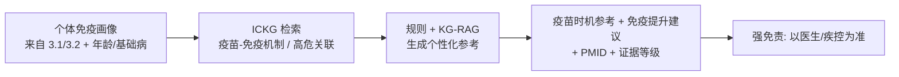

<!--
3.3 Personalized Vaccination and Immune-Boosting Guidance
3.3 个性化疫苗与免疫提升建议
-->

# 3.3 个性化疫苗与免疫提升建议

> **使用场景 / 解决的问题**：普通人面对"该打哪些疫苗、什么时候打、怎么提升免疫力"往往只能听碎片化建议。本场景基于个体免疫状态，给出**有文献依据、可追溯、强免责**的疫苗接种与免疫提升（生活方式）参考——明确科普定位，引导而非替代专业接种与诊疗决策。

## 一、应用价值

免疫力并非"越强越好"，而是**平衡且有韧性**。[Manoharan-2025](https://doi.org/10.1111/acel.70063) 指出最佳免疫韧性能**增强疫苗应答**、降低心血管/阿尔茨海默/严重感染负担，且中年是干预窗口；[Ahuja-2023](https://doi.org/10.1038/s41467-023-38238-6) 指出免疫韧性退化"潜在可逆，可通过降低炎症压力实现"。这为"个体化疫苗时机 + 免疫提升生活方式"提供了科学落点。

> 价值：把"通用疫苗/养生建议"细化为**结合个体免疫画像的、可追溯的参考**，并始终强调"具体接种以医生/疾控建议为准"。

## 二、ICKG 适配性

| 需求 | ICKG 提供 | 用途 |
|---|---|---|
| 疫苗-免疫机制 | `intervention/protein/cell_type` + `promotes/increases` | 解释某疫苗诱导的免疫反应路径 |
| 免疫力影响因素 | `chemical/phenotype` + 因果边 | 把生活方式因素（营养、睡眠等）链到免疫指标 |
| 人群/高危关联 | `associated_with`/`help_identify` | 标记需优先接种的高危信号 |
| 文献来源 | 每边 `pmids` | 每条建议可追溯 |

## 三、技术路线



## 四、最小可执行示例

```python
# personalized_vaccination.py
# 英文/中文：基于个体免疫画像，从 ICKG 生成个性化疫苗/免疫提升参考（科普向，强免责）
import argparse, json

DISCLAIMER = ("【重要免责声明】本内容为健康科普参考，非医疗建议。具体疫苗接种"
              "请遵循医生与疾控机构指引；如有基础病/免疫缺陷请先咨询专科医生。")

def parse_args():
    p = argparse.ArgumentParser(description="基于 ICKG 的个性化疫苗与免疫提升建议（科普向）")
    p.add_argument("--profile", "-p", required=True, help="个体免疫画像 JSON（来自 3.1/3.2）")
    p.add_argument("--out",     "-o", required=True, help="输出 Markdown 路径")
    p.add_argument("--min-grade", default="B", choices=["A","B","C","D"],
                   help="纳入建议的最低证据等级（默认 B，建议从严）")
    return p.parse_args()

def main():
    a = parse_args()
    prof = json.load(open(a.profile, encoding="utf-8"))
    # 1) 依据画像中的高危信号/年龄/基础病检索 ICKG
    # 2) 仅保留 >= min-grade 的证据生成参考
    # 3) 拼接强免责
    # ...
    print(DISCLAIMER)

if __name__ == "__main__":
    main()
```

### 示例输出（节选）

> **个性化免疫参考（科普）**
> - 您的免疫韧性偏低且年龄 >60，**流感/肺炎球菌疫苗的获益人群证据较强**（B 级）[PMID: …]——建议与医生确认接种时机。
> - 持续 IL-6 偏高提示慢性低度炎症；改善睡眠、规律有氧、控制代谢有助于降低炎症压力（免疫韧性"潜在可逆"）[PMID: …]。
> - ⚠ 本内容不构成接种处方，具体以医生与疾控建议为准。
> 【免责声明】…

## 五、文献依据

- ⭐ [Manoharan-2025] [**Immune Resilience as a Salutogenic Force in Healthy Aging**](https://doi.org/10.1111/acel.70063). *Aging Cell*. 最佳免疫韧性增强疫苗应答、中年干预窗口。
- ⭐ [Ahuja-2023] [**Immune resilience despite inflammatory stress promotes longevity**](https://doi.org/10.1038/s41467-023-38238-6). *Nat Commun*. 免疫韧性退化"可通过降低炎症压力逆转"。
- [Cui-2024] [**Dictionary of immune responses to cytokines at single-cell resolution**](https://doi.org/10.1038/s41586-023-06816-9). *Nature*. 免疫应答机制金标准。

## 六、可行性与挑战

| 维度 | 评估 | 说明 |
|---|---|---|
| 数据就绪度 | ★★★ | ICKG 就绪；依赖个体画像（3.1/3.2）输入 |
| 工程复杂度 | ★★ | 检索 + 规则 + KG-RAG |
| 算力需求 | ★ | 主要是 LLM 调用 |
| 主要挑战 | — | **强合规边界**：绝不可暗示处方/替代接种决策；证据从严（默认 ≥B）；避免"越多越好"的误导 |

## 七、推荐深读

- ⭐ [Manoharan-2025 IR & Vaccine Response](https://doi.org/10.1111/acel.70063) — 看 IR 与疫苗应答关系
- ⭐ [Ahuja-2023 Immune Resilience](https://doi.org/10.1038/s41467-023-38238-6) — 看免疫韧性可逆性

miao!
