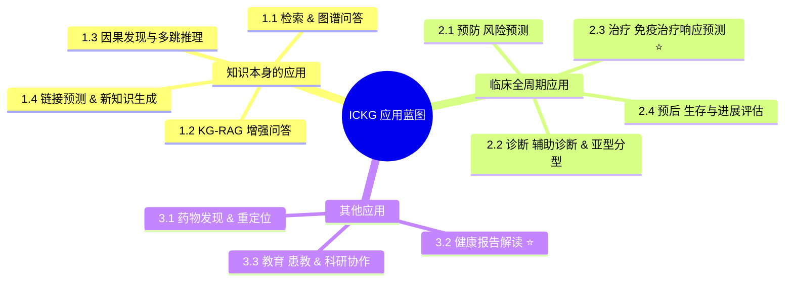

<!--
ICKG Application Blueprint — Main Report
免疫细胞知识图谱（ICKG）临床与拓展应用蓝图 — 主报告
-->

# 免疫细胞知识图谱（ICKG）临床与拓展应用蓝图

> **版本**：v1.0 · 2026-05-21  
> **作者**：Siyu Zhou (zhousiyu9875@gmail.com)  
> **配套文献**：见 [`references.md`](./references.md)

---

## 执行摘要

本项目已基于 Baichuan-M2-32B + QLoRA 微调 + 结构化提示的范式，从 2016–2026 年 PubMed 免疫学文献中抽取出一个**包含 423,823 个三元组、235,457 个唯一实体、19 类实体、89 类关系的免疫细胞知识图谱（Immune Cell Knowledge Graph，ICKG）**。其核心实体涵盖 *cell_type、phenotype、protein、disease、intervention、pathology、chemical* 七大类，关系类型则覆盖了 *associated_with / increases / decreases / help_identify / results_in / promotes / treatment_for / inhibits* 等具备明确因果与定量含义的语义。

参考 [Zhou-2026](https://doi.org/10.1038/s41746-025-02232-y) 的 LCKG 范式与 [Gao-2025](https://doi.org/10.1038/s41467-025-62781-z) 的 MDKG 临床预测范式，本报告认为 ICKG 在"完成构建"之后，绝非只能用于关键词检索，而是可以系统性地服务于**知识本身的应用、临床全周期决策、以及药物发现与教育**三大类共 11 个子场景。其中三个最具落地价值的旗舰场景分别是：

1. **免疫检查点抑制剂（ICI）响应预测**（→ [`2.3_treatment.md`](./02_clinical_applications/2.3_treatment.md)）
2. **健康/体检报告免疫学解读**（→ [`3.2_health_report_interpretation.md`](./03_other_applications/3.2_health_report_interpretation.md)）
3. **基于 KG embedding 的自身免疫疾病早期风险预测**（→ [`2.1_prevention.md`](./02_clinical_applications/2.1_prevention.md)）

---

## 应用全景图

---

## 优先级矩阵

按 **价值 × 可行性 × 数据就绪度** 三维打分（每维 1–5 分，得分越高越优先），三个旗舰被推荐先做：

| 子场景 | 临床价值 | 技术可行性 | 数据就绪度 | 综合 | 备注 |
|---|---|---|---|---|---|
| 1.1 检索与图谱问答 | 3 | 5 | 5 | 13 | 最容易交付，可作为 Demo 入口 |
| 1.2 KG-RAG | 4 | 4 | 4 | 12 | 与 1.1 强耦合，可并行做 |
| 1.3 因果发现 | 4 | 4 | 5 | 13 | 已有有向因果关系（increases/inhibits 等）天然支持 |
| 1.4 新知识生成 | 4 | 3 | 4 | 11 | 需要 embedding 训练算力 |
| 2.1 预防（自免风险预测） | 5 | 3 | 2 | 10 | ⭐ 旗舰；需要 UKB 等 EHR 队列 |
| 2.2 诊断 | 4 | 3 | 3 | 10 | 依赖临床合作 |
| **2.3 治疗（ICI 响应预测）** | **5** | **4** | **4** | **13** | ⭐⭐ 一号旗舰；TCGA/GEO 公开数据可启动 |
| 2.4 预后 | 4 | 3 | 3 | 10 | 与 2.3 共享技术栈 |
| 3.1 药物重定位 | 4 | 4 | 4 | 12 | 与 DrugBank/ChEMBL 链接即可启动 |
| **3.2 健康报告解读** | **5** | **3** | **4** | **12** | ⭐ 旗舰；2B 个体级落地最快 |
| 3.3 教育 & 科研 | 3 | 5 | 5 | 13 | 低投入高曝光 |

> ⭐ 排序结论：**推荐资源分配优先级 = 2.3 > 3.2 > 2.1**，同时把 1.1/1.3/3.3 作为低成本"流量入口"早期上线。

---

## 三大类应用目录

### 一、知识本身的应用

| # | 子场景 | 文件 |
|---|---|---|
| 1.1 | 知识检索与图谱问答 | [01_knowledge_applications/1.1_retrieval_and_qa.md](./01_knowledge_applications/1.1_retrieval_and_qa.md) |
| 1.2 | KG-RAG：LLM 增强问答 | [01_knowledge_applications/1.2_kg_rag.md](./01_knowledge_applications/1.2_kg_rag.md) |
| 1.3 | 因果发现与多跳推理 | [01_knowledge_applications/1.3_causal_discovery.md](./01_knowledge_applications/1.3_causal_discovery.md) |
| 1.4 | 链接预测与新知识生成 | [01_knowledge_applications/1.4_new_knowledge_generation.md](./01_knowledge_applications/1.4_new_knowledge_generation.md) |

### 二、临床全周期应用

| # | 子场景 | 文件 |
|---|---|---|
| 2.1 | 预防：免疫相关疾病风险预测 | [02_clinical_applications/2.1_prevention.md](./02_clinical_applications/2.1_prevention.md) |
| 2.2 | 诊断：辅助诊断与亚型分型 | [02_clinical_applications/2.2_diagnosis.md](./02_clinical_applications/2.2_diagnosis.md) |
| 2.3 | 治疗：免疫治疗响应预测 ⭐ | [02_clinical_applications/2.3_treatment.md](./02_clinical_applications/2.3_treatment.md) |
| 2.4 | 预后：生存与进展评估 | [02_clinical_applications/2.4_prognosis.md](./02_clinical_applications/2.4_prognosis.md) |

### 三、其他应用

| # | 子场景 | 文件 |
|---|---|---|
| 3.1 | 药物发现与重定位 | [03_other_applications/3.1_drug_repurposing.md](./03_other_applications/3.1_drug_repurposing.md) |
| 3.2 | 健康报告解读 ⭐ | [03_other_applications/3.2_health_report_interpretation.md](./03_other_applications/3.2_health_report_interpretation.md) |
| 3.3 | 教育、患教与科研协作 | [03_other_applications/3.3_education_and_research.md](./03_other_applications/3.3_education_and_research.md) |

---

## 推荐技术栈

| 层 | 选型 | 说明 |
|---|---|---|
| 图数据库 | **Neo4j 5.x** | 与 [Zhou-2026](https://doi.org/10.1038/s41746-025-02232-y) LCKG 工程范式一致；APOC + GDS 插件 |
| KG Embedding | **PyKEEN** / **RDF2Vec** | [Gao-2025](https://doi.org/10.1038/s41467-025-62781-z) 使用 RDF2Vec(200d)；PyKEEN 支持 TransE/RotatE/ComplEx |
| GNN 框架 | **PyTorch Geometric** / **DGL** | 用于 [Zhao-2023](https://doi.org/10.1093/bib/bbad023) 范式的 ICI 响应预测 |
| KG-RAG | **LangChain Neo4j GraphCypherQAChain** / **LlamaIndex KnowledgeGraphIndex** | 接入项目已有的 Baichuan-M2 或商用 LLM |
| Agent | **LangGraph** / **AutoGen** | 用于多跳子图检索 + 自校正（参考 [Hu-2025](https://doi.org/10.3389/fmed.2025.1716327)） |
| 前端 | **Gradio** / **Streamlit** | 快速 Demo；正式产品可上 Next.js + Cytoscape.js |
| 临床特征 | **PheCode 体系** | 与 KG 实体对齐（[Gao-2025](https://doi.org/10.1038/s41467-025-62781-z) 范式）便于与 EHR 融合 |

---

## 推荐"先读 5 篇"（Must-Read）

1. [Gao-2025](https://doi.org/10.1038/s41467-025-62781-z) — **MDKG**：KG embedding + 临床特征做风险预测的范式样板。
2. [Zhou-2026](https://doi.org/10.1038/s41746-025-02232-y) — **LCKG**：当前 ICKG 项目所参考的核心方法学论文。
3. [Zhao-2023](https://doi.org/10.1093/bib/bbad023) — **KG-引导 GNN 预测 ICI 响应**：旗舰场景 2.3 的方法学原型。
4. [Soman-2024](https://doi.org/10.1093/bioinformatics/btae560) — **SPOKE KG-RAG**：KG 增强 LLM 问答的奠基性工程。
5. [Chandak-2023](https://doi.org/10.1038/s41597-023-01960-3) — **PrimeKG**：精准医学知识图谱的工业级数据底座，可作 ICKG 横向对照。

---

## 风险与免责声明

参考 [Zhou-2026](https://doi.org/10.1038/s41746-025-02232-y) 的伦理立场，本蓝图所有"临床应用"场景需遵守：

1. **仅供研究使用**：任何面向真实患者的部署需经过 IRB 审批与前瞻性临床验证。
2. **不替代医生判断**：所有 LLM/KG 输出仅为辅助决策依据，最终临床决定由具备资质的临床医生作出。
3. **可追溯性**：所有自然语言输出必须能追溯到 ICKG 中具体三元组或外部权威文献（PMID/DOI）。
4. **数据合规**：涉及患者数据时，遵守 GDPR / HIPAA / 中国《个人信息保护法》《数据安全法》。
5. **动态维护**：ICKG 需定期增量再训练以纳入新的临床指南、药物批准与诊断标准。

---

## 后续行动建议

| 阶段 | 时间窗 | 关键交付物 |
|---|---|---|
| **P0 基础设施** | 1–2 个月 | Neo4j 入库 + 1.1 检索 Demo + 1.3 因果路径可视化 |
| **P1 旗舰 MVP** | 3–6 个月 | 2.3 ICI 响应预测原型（TCGA SKCM/NSCLC）+ 3.2 体检报告解读 Demo |
| **P2 临床合作** | 6–12 个月 | 2.1 自免风险预测前瞻队列 + 3.1 药物重定位候选清单 |
| **P3 平台化** | 12+ 个月 | 整合为 ICKG-Workbench，含 KG-RAG、Agent、预测 API、可视化 |

miao!
