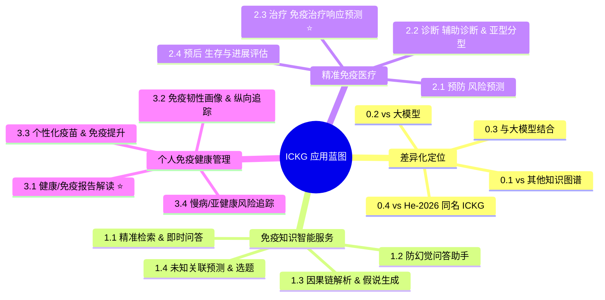

<!--
ICKG Application Blueprint — Main Report
免疫细胞知识图谱（ICKG）临床与拓展应用蓝图 — 主报告
-->

# 免疫细胞知识图谱（ICKG）临床与拓展应用蓝图

> **版本**：v1.0 · 2026-05-21  
> **作者**：Siyu Zhou (zhousiyu9875@gmail.com)  
> **配套文献**：见 [`references.md`](./references.md)

---

## 执行摘要

本项目已基于 Baichuan-M2-32B + QLoRA 微调 + 结构化提示的范式，从 2016–2026 年 PubMed 免疫学文献中抽取出一个**包含 423,823 个三元组、235,457 个唯一实体、19 类实体、89 类关系的免疫细胞知识图谱（Immune Cell Knowledge Graph，ICKG）**。其核心实体涵盖 *cell_type、phenotype、protein、disease、intervention、pathology、chemical* 七大类，关系类型则覆盖了 *associated_with / increases / decreases / help_identify / results_in / promotes / treatment_for / inhibits* 等具备明确因果与定量含义的语义。

参考 [Zhou-2026](https://doi.org/10.1038/s41746-025-02232-y) 的 LCKG 范式与 [Gao-2025](https://doi.org/10.1038/s41467-025-62781-z) 的 MDKG 临床预测范式，本报告认为 ICKG 在"完成构建"之后，绝非只能用于关键词检索，而是可以系统性地服务于**免疫知识智能服务、精准免疫医疗、以及个人免疫健康管理**三大类共 12 个子场景；在此之上，本蓝图先用 4 篇专题回答 ICKG 的**差异化定位**（见下节）。三个最具落地价值的旗舰场景分别是：

1. **免疫检查点抑制剂（ICI）响应预测**（→ [`2.3_treatment.md`](./02_clinical_applications/2.3_treatment.md)）
2. **健康/免疫报告解读（含多维证据可靠性分级）**（→ [`3.1_health_report_interpretation.md`](./03_other_applications/3.1_health_report_interpretation.md)）
3. **基于 KG embedding 的自身免疫疾病早期风险预测**（→ [`2.1_prevention.md`](./02_clinical_applications/2.1_prevention.md)）

---

## 差异化定位：为什么是 ICKG（先回答三个核心问题）

在讲应用之前，先正面回答三个最常被问到的战略问题（各配一篇专题）：

| 问题 | 一句话答案 | 专题 |
|---|---|---|
| **① 相比其他相关知识图谱有什么优势？** | 唯一把"免疫机制层→临床动作层"用 89 类关系、23 万实体、逐边可溯源地打通的免疫专用图谱（对照同名的 [He-2026 ICKG](https://doi.org/10.1038/s44387-025-00060-4) 仅 2 类关系/基因集注释） | [`0.1_vs_other_kgs.md`](./00_positioning/0.1_vs_other_kgs.md) |
| **② 会被不断进化的大模型淘汰吗？** | 不会，方向相反——大模型越强越需要"可溯源、可审计、可更新"的事实底座；KG 解决大模型的幻觉/时效/可问责短板 | [`0.2_vs_llm.md`](./00_positioning/0.2_vs_llm.md) |
| **③ 与 GPT/Claude/Gemini 如何结合？** | 大模型管"语言与推理"、ICKG 管"事实与证据"，按 KG-RAG→GraphRAG→Agentic 三档结合，落地防幻觉问答/可解释决策/报告解读 | [`0.3_kg_llm_synergy.md`](./00_positioning/0.3_kg_llm_synergy.md) |
| **④ 与同名的 He-2026 ICKG 究竟差在哪？** | He-2026 把免疫文献做成"科研基因集注释工具"并明确把临床列为 scope 外；本项目接续其自述局限，推进到"含临床实体、89 类有向定量关系、机制→临床可执行" | [`0.4_vs_he2026_ickg.md`](./00_positioning/0.4_vs_he2026_ickg.md) |

---

## 应用全景图

---

## 优先级矩阵

按 **价值 × 可行性 × 数据就绪度** 三维打分（每维 1–5 分，得分越高越优先），三个旗舰被推荐先做：

| 子场景 | 临床/健康价值 | 技术可行性 | 数据就绪度 | 综合 | 备注 |
|---|---|---|---|---|---|
| 1.1 精准检索与即时问答 | 3 | 5 | 5 | 13 | 最容易交付，可作为 Demo 入口 |
| 1.2 防幻觉问答助手 | 4 | 4 | 4 | 12 | 与 1.1 强耦合，可并行做 |
| 1.3 因果链解析与假说生成 | 4 | 4 | 5 | 13 | 已有有向因果关系（increases/inhibits 等）天然支持 |
| 1.4 未知关联预测与选题 | 4 | 3 | 4 | 11 | 需要 embedding 训练算力 |
| 2.1 预防（自免风险预测） | 5 | 3 | 2 | 10 | ⭐ 旗舰；需要 UKB 等 EHR 队列 |
| 2.2 诊断 | 4 | 3 | 3 | 10 | 依赖临床合作 |
| **2.3 治疗（ICI 响应预测）** | **5** | **4** | **4** | **13** | ⭐⭐ 一号旗舰；TCGA/GEO 公开数据可启动 |
| 2.4 预后 | 4 | 3 | 3 | 10 | 与 2.3 共享技术栈 |
| **3.1 健康/免疫报告解读** | **5** | **3** | **4** | **12** | ⭐ 旗舰；2C 个体级落地最快；含多维证据分级 |
| 3.2 免疫韧性画像与追踪 | 4 | 3 | 3 | 10 | 需纵向数据与人群常模 |
| 3.3 个性化疫苗/免疫提升 | 3 | 4 | 3 | 10 | 科普向，强合规边界 |
| 3.4 慢病/亚健康风险追踪 | 4 | 3 | 2 | 9 | 需长期纵向数据 |

> ⭐ 排序结论：**推荐资源分配优先级 = 2.3 > 3.1 > 2.1**，同时把 1.1/1.3 作为低成本"流量入口"早期上线。

---

## 应用目录

### 〇、差异化定位（先回答"为什么是 ICKG"）

| # | 专题 | 文件 |
|---|---|---|
| 0.1 | ICKG vs 其他相关知识图谱 | [00_positioning/0.1_vs_other_kgs.md](./00_positioning/0.1_vs_other_kgs.md) |
| 0.2 | ICKG vs 大模型：会被淘汰吗 | [00_positioning/0.2_vs_llm.md](./00_positioning/0.2_vs_llm.md) |
| 0.3 | ICKG × 最先进大模型如何结合 | [00_positioning/0.3_kg_llm_synergy.md](./00_positioning/0.3_kg_llm_synergy.md) |
| 0.4 | ICKG vs He-2026 同名 ICKG（逐项深度对比） | [00_positioning/0.4_vs_he2026_ickg.md](./00_positioning/0.4_vs_he2026_ickg.md) |

### 一、免疫知识智能服务

| # | 子场景 | 文件 |
|---|---|---|
| 1.1 | 免疫知识的精准检索与即时问答 | [01_knowledge_applications/1.1_retrieval_and_qa.md](./01_knowledge_applications/1.1_retrieval_and_qa.md) |
| 1.2 | 可溯源、防幻觉的免疫问答助手 | [01_knowledge_applications/1.2_kg_rag.md](./01_knowledge_applications/1.2_kg_rag.md) |
| 1.3 | 免疫机制的因果链解析与假说生成 | [01_knowledge_applications/1.3_causal_discovery.md](./01_knowledge_applications/1.3_causal_discovery.md) |
| 1.4 | 未知免疫关联的预测与科研选题 | [01_knowledge_applications/1.4_new_knowledge_generation.md](./01_knowledge_applications/1.4_new_knowledge_generation.md) |

### 二、精准免疫医疗（预防—诊断—治疗—预后）

| # | 子场景 | 文件 |
|---|---|---|
| 2.1 | 预防：免疫相关疾病风险预测 | [02_clinical_applications/2.1_prevention.md](./02_clinical_applications/2.1_prevention.md) |
| 2.2 | 诊断：辅助诊断与亚型分型 | [02_clinical_applications/2.2_diagnosis.md](./02_clinical_applications/2.2_diagnosis.md) |
| 2.3 | 治疗：免疫治疗响应预测 ⭐ | [02_clinical_applications/2.3_treatment.md](./02_clinical_applications/2.3_treatment.md) |
| 2.4 | 预后：生存与进展评估 | [02_clinical_applications/2.4_prognosis.md](./02_clinical_applications/2.4_prognosis.md) |

### 三、个人免疫健康管理

| # | 子场景 | 文件 |
|---|---|---|
| 3.1 | 健康/免疫报告解读 ⭐（含多维证据可靠性分级） | [03_other_applications/3.1_health_report_interpretation.md](./03_other_applications/3.1_health_report_interpretation.md) |
| 3.2 | 免疫韧性画像与纵向追踪 | [03_other_applications/3.2_immune_resilience_profiling.md](./03_other_applications/3.2_immune_resilience_profiling.md) |
| 3.3 | 个性化疫苗与免疫提升建议 | [03_other_applications/3.3_personalized_vaccination.md](./03_other_applications/3.3_personalized_vaccination.md) |
| 3.4 | 慢病/亚健康免疫风险追踪 | [03_other_applications/3.4_chronic_subhealth_monitoring.md](./03_other_applications/3.4_chronic_subhealth_monitoring.md) |

---

## 推荐技术栈

| 层 | 选型 | 说明 |
|---|---|---|
| 图数据库 | **Neo4j 5.x** | 与 [Zhou-2026](https://doi.org/10.1038/s41746-025-02232-y) LCKG 工程范式一致；APOC + GDS 插件 |
| KG Embedding | **PyKEEN** / **RDF2Vec** | [Gao-2025](https://doi.org/10.1038/s41467-025-62781-z) 使用 RDF2Vec(200d)；PyKEEN 支持 TransE/RotatE/ComplEx |
| GNN 框架 | **PyTorch Geometric** / **DGL** | 用于 [Zhao-2023](https://doi.org/10.1093/bib/bbad023) 范式的 ICI 响应预测 |
| KG-RAG | **LangChain Neo4j GraphCypherQAChain** / **LlamaIndex KnowledgeGraphIndex** | 接入项目已有的 Baichuan-M2 或商用 LLM |
| Agent | **LangGraph** / **AutoGen** | 用于多跳子图检索 + 自校正（参考 [Hu-2025](https://doi.org/10.3389/fmed.2025.1716327)） |
| 前端 | **Gradio** / **Streamlit** | 快速 Demo；正式产品可上 Next.js + Cytoscape.js |
| 临床特征 | **PheCode 体系** | 与 KG 实体对齐（[Gao-2025](https://doi.org/10.1038/s41467-025-62781-z) 范式）便于与 EHR 融合 |

---

## 推荐"先读 7 篇"（Must-Read）

1. [He-2026](https://doi.org/10.1038/s44387-025-00060-4) — **同名 ICKG**：理解本项目差异化定位的最直接对照（仅 2 类关系、基因集注释导向）。
2. [Gao-2025](https://doi.org/10.1038/s41467-025-62781-z) — **MDKG**：KG embedding + 临床特征做风险预测的范式样板。
3. [Zhou-2026](https://doi.org/10.1038/s41746-025-02232-y) — **LCKG**：当前 ICKG 项目所参考的核心方法学论文。
4. [Zhao-2023](https://doi.org/10.1093/bib/bbad023) — **KG-引导 GNN 预测 ICI 响应**：旗舰场景 2.3 的方法学原型。
5. [Soman-2024](https://doi.org/10.1093/bioinformatics/btae560) — **SPOKE KG-RAG**：KG 增强 LLM 问答的奠基性工程。
6. [Chandak-2023](https://doi.org/10.1038/s41597-023-01960-3) — **PrimeKG**：精准医学知识图谱的工业级数据底座，可作 ICKG 横向对照。
7. [Guyatt-2008](https://doi.org/10.1136/bmj.39489.470347.AD) — **GRADE**：临床证据分级金标准，旗舰场景 3.1 多维证据可靠性分级的基准。

---

## 风险与免责声明

参考 [Zhou-2026](https://doi.org/10.1038/s41746-025-02232-y) 的伦理立场，本蓝图所有"临床应用"场景需遵守：

1. **仅供研究使用**：任何面向真实患者的部署需经过 IRB 审批与前瞻性临床验证。
2. **不替代医生判断**：所有 LLM/KG 输出仅为辅助决策依据，最终临床决定由具备资质的临床医生作出。
3. **可追溯性**：所有自然语言输出必须能追溯到 ICKG 中具体三元组或外部权威文献（PMID/DOI）。
4. **数据合规**：涉及患者数据时，遵守 GDPR / HIPAA / 中国《个人信息保护法》《数据安全法》。
5. **动态维护**：ICKG 需定期增量再训练以纳入新的临床指南、药物批准与诊断标准。

---

## 后续行动建议

| 阶段 | 时间窗 | 关键交付物 |
|---|---|---|
| **P0 基础设施** | 1–2 个月 | Neo4j 入库 + 1.1 检索 Demo + 1.3 因果路径可视化 |
| **P1 旗舰 MVP** | 3–6 个月 | 2.3 ICI 响应预测原型（TCGA SKCM/NSCLC）+ 3.1 健康/免疫报告解读 Demo（含证据分级） |
| **P2 临床/健康合作** | 6–12 个月 | 2.1 自免风险预测前瞻队列 + 3.2 免疫韧性画像 / 3.4 慢病免疫追踪 试点 |
| **P3 平台化** | 12+ 个月 | 整合为 ICKG-Workbench，含 KG-RAG、Agent、预测 API、可视化 |

miao!
